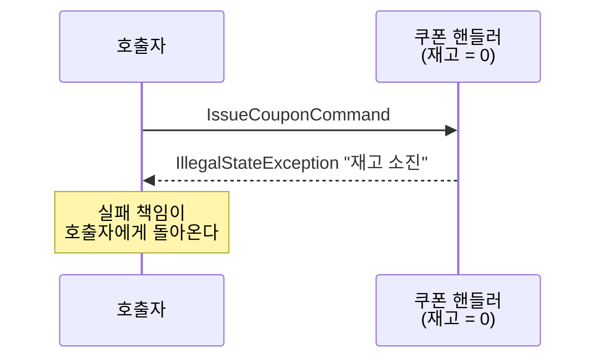
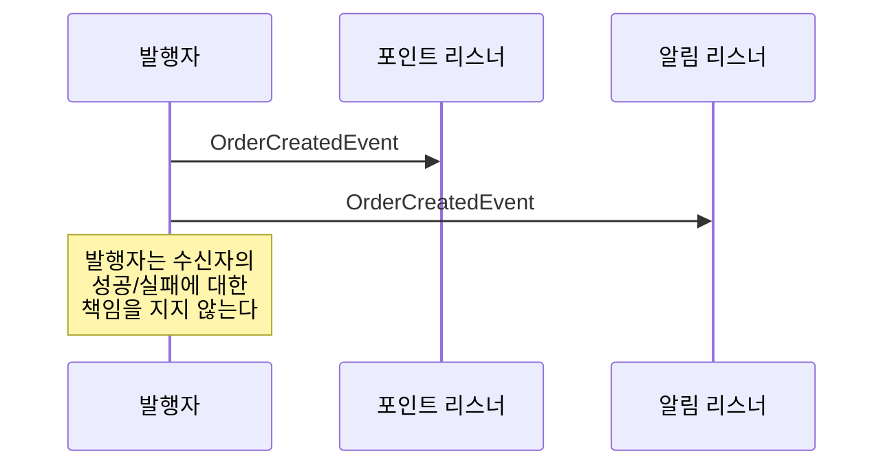
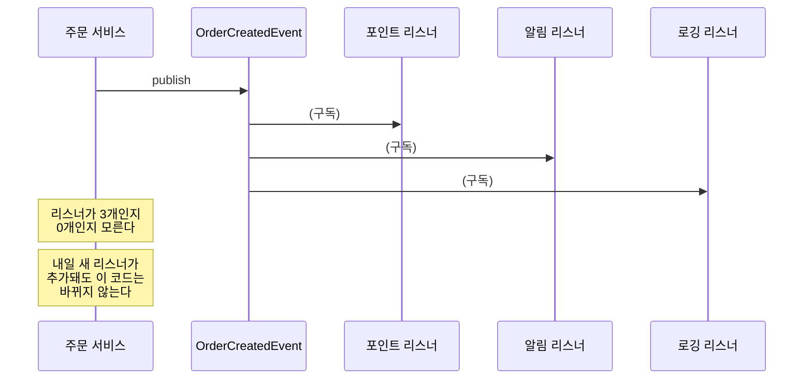
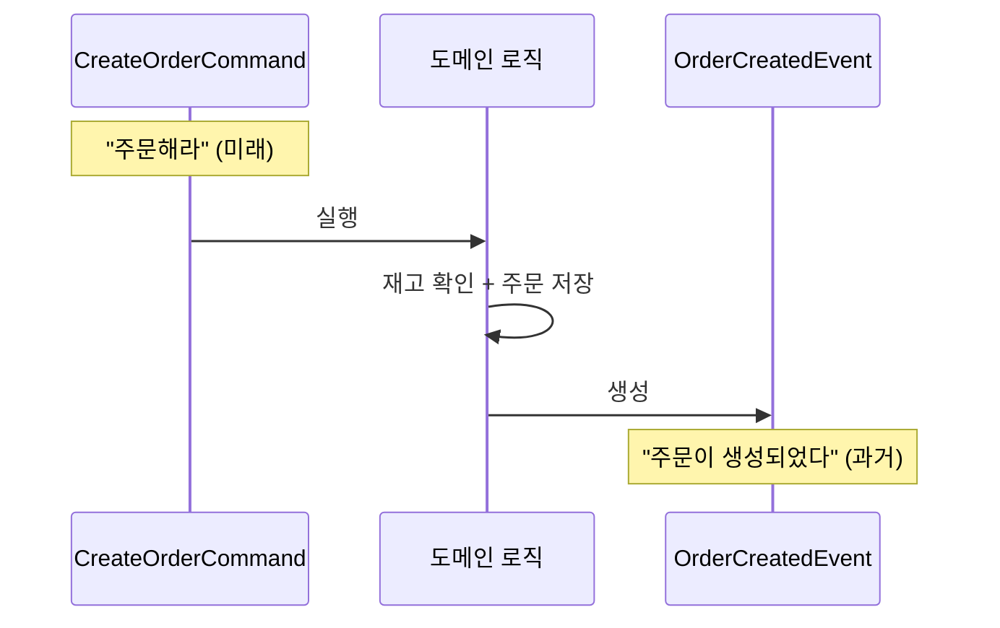

# Step 0 — Command vs Event

---

## 하나의 주문에서 시작하자

주문 생성 플로우를 떠올려보자. 사용자가 "주문하기" 버튼을 누르면 서버에서 이런 일이 벌어진다.

```
1. 재고 차감
2. 쿠폰 사용
3. 결제 요청
4. 주문 저장
5. 포인트 적립
6. 알림 발송
```

여섯 가지 작업이다. 전부 "주문"이라는 행위에 뒤따르는 작업이다.

그런데 여기서 질문 하나.

> **이 여섯 가지가 전부 같은 성격의 작업인가?**

"재고 차감"과 "알림 발송"이 같은 무게인가?
"쿠폰 사용"과 "포인트 적립"이 같은 긴급도인가?

직관적으로 아니라는 걸 안다. 근데 **왜** 다른지를 정확히 말하기가 어렵다.
이 Step에서 그 "왜"를 잡는다.

---

## "~해라"와 "~가 일어났다"

여섯 가지 작업을 다시 보자. 이번에는 **말투**에 주목해서.

```
"재고를 차감해라"
"쿠폰을 사용해라"
"결제를 요청해라"
"주문을 저장해라"
```

여기까지는 전부 **"~해라"**다. 아직 안 일어난 일이고, 실패할 수 있다.

```
"주문이 생성되었다"
```

이건 **"~되었다"**다. 이미 일어난 사실이고, 되돌릴 수 없다.

그러면 "포인트를 적립해라"와 "주문이 생성되었다"는 뭐가 다른가?

```
"포인트를 적립해라"      ← 누군가에게 시키는 것
"주문이 생성되었다"      ← 누가 듣든 상관없이 사실을 알리는 것
```

전자가 **Command**고, 후자가 **Event**다.

---

## Command의 타임스탬프와 Event의 타임스탬프는 의미가 다르다

코드로 보면 차이가 선명해진다.

```java
class IssueCouponCommand {
    String commandId;      // 멱등성 식별자 (Step 7에서 다시 만난다)
    String userId;
    String couponType;
    Instant requestedAt;   // "요청한 시각" — 타임아웃, 감사 추적용
}

class OrderCreatedEvent {
    String eventId;
    String orderId;
    String userId;
    long amount;
    Instant occurredAt;    // "사실이 확정된 시각" — 순서 판단의 기준
}
```

둘 다 타임스탬프가 있을 수 있다. 차이는 **의미**다.

- Command의 `requestedAt`은 **"언제 요청했는가"**다. 아직 실행되지 않은 의도의 시각이다.
- Event의 `occurredAt`은 **"언제 일어났는가"**다. 이미 확정된 사실의 시각이다.

이 객체가 담고 있는 것이 **"의도"인지 "사실"인지** — 이게 Command와 Event의 본질적 차이다.

> **CommandEventConceptTest** — `Command는_미래시제다_아직_일어나지_않은_일()`과
> `Event는_과거시제다_이미_확정된_사실()`에서 이 구조적 차이를 직접 확인할 수 있다.

이게 나중에 왜 중요해지는가?

Event를 DB에 저장할 때(Step 3 Event Store), `occurredAt`은 순서 판단의 기준이 된다. Kafka 토픽에서 이벤트를 재처리할 때(Step 6), "이 이벤트가 저 이벤트보다 먼저 일어났는가?"를 `occurredAt`으로 판단한다.

Command도 저장할 수 있다. 실패 시 재시도를 위한 Command 큐, Saga에서 보상 트랜잭션을 위한 원본 Command 보관, 감사(audit) 목적의 요청 로그 — 전부 Command를 저장하는 실무 패턴이다. 다만 Command를 저장할 때 기준이 되는 것은 `requestedAt`(요청 시각)이고, Event를 저장할 때 기준이 되는 것은 `occurredAt`(확정 시각)이다. **같은 "저장"이지만 의미가 다르다.**

Command의 `commandId`는 Step 7(Idempotent Consumer)에서 다시 만난다. 같은 Command가 2번 전달되었을 때 `commandId`로 중복을 판별하는 것이 멱등 처리의 핵심이다.

---

## 실패하면 누가 책임지는가

Command와 Event의 가장 실무적인 차이는 여기서 나온다.

쿠폰 재고가 0인 상황에서 Command를 실행하면:

```java
handler.handle(new IssueCouponCommand(userId, "WELCOME"));
// → IllegalStateException: "재고 소진"
// → 이 예외를 호출자가 처리해야 한다.
```



이미 일어난 사실을 Event로 발행하면:

```java
publisher.publishEvent(OrderCreatedEvent.of(orderId, userId, amount));
// → Event는 발행 시점에 수신자의 성공/실패에 대한 책임을 지지 않는다.
// → 누가 듣는지, 리스너가 성공하는지는 발행자의 관심사가 아니다.
```



> **CommandEventBehaviorTest** — `Command는_실패할_수_있고_발신자가_처리해야_한다()`와
> `Event는_이미_일어난_사실이므로_발행_자체는_실패하지_않는다()`에서 확인할 수 있다.

이건 **개념**이다. 이 개념을 구현에서도 성립시키려면 **별도 메커니즘이 필요하다.** Spring의 `@EventListener`는 기본이 동기 실행이라, 리스너 예외가 발행자 TX를 롤백시킨다. 비동기 실행(`@Async`), 커밋 후 실행(`@TransactionalEventListener`), 외부 전달(Outbox + Kafka) — 이런 장치들이 "수신자의 실패가 발행자에게 전파되지 않는다"는 개념을 구현에서 보장해주는 것이다. 이 장치들이 Step 1~6의 여정이다.

이 차이가 설계 판단을 가른다.

> "쿠폰 사용이 실패하면 주문도 실패해야 하는가?"
> → Yes면 Command로 동기 처리해야 한다.
>
> "포인트 적립이 실패해도 주문은 유지해야 하는가?"
> → Yes면 Event로 분리해도 된다.

---

## 그러면 누가 듣는지는 왜 상관없는가

Command는 수신자를 지정한다. "쿠폰 서비스야, 이 쿠폰 사용해."

```java
class OrderService {
    private final CouponService couponService;   // 직접 알고 있다

    void createOrder(...) {
        couponService.useCoupon(couponId);        // "너가 해"
    }
}
```

Event는 수신자를 모른다. "주문이 생성됐어. 알아서 해."

```java
class OrderService {
    private final ApplicationEventPublisher publisher;

    void createOrder(...) {
        publisher.publishEvent(OrderCreatedEvent.of(order.getOrderId(), order.getUserId(), order.getAmount()));
        // 누가 듣든 내 알 바 아님
    }
}
```



> **CommandEventConceptTest** — `Command는_수신자를_특정한다_1대1()`과
> `Event는_수신자를_모른다_1대N()`에서 확인할 수 있다.

이게 Step 1에서 "직접 호출 → 이벤트 전환"을 하면 **의존성이 4개에서 1개로 줄어드는** 이유다.

---

## Command 실행 결과가 Event가 된다

여기까지 읽으면 한 가지 의문이 생긴다.

> "그러면 Command와 Event가 완전히 별개인가?"

아니다. 같은 도메인 안에서 **Command → 실행 → Event**라는 흐름이 존재한다.

```
CreateOrderCommand  →  (도메인 로직 실행)  →  OrderCreatedEvent
     "주문해라"          재고 확인, 저장         "주문이 생성되었다"
      미래형                현재                    과거형
```



```java
@Transactional
void handle(CreateOrderCommand cmd) {
    // Command를 받아서 실행한다 (미래 → 현재)
    Order order = Order.create(cmd.userId(), cmd.amount());
    orderRepository.save(order);

    // 실행 결과를 Event로 발행한다 (현재 → 과거 확정)
    publisher.publishEvent(OrderCreatedEvent.of(order.getOrderId(), order.getUserId(), order.getAmount()));
}
```

> **CommandEventBehaviorTest** — `같은_도메인에서_Command_실행_결과가_Event가_된다()`에서
> 이 흐름을 따라가볼 수 있다.

이 흐름이 중요한 이유는 Step 3과 Step 6에서 돌아오기 때문이다.

```
Step 3: 도메인 저장 + 이벤트 기록을 같은 TX로 묶자 (Event Store)
Step 6: 릴레이가 Event Store → Kafka로 발행하자 (Outbox)
```

**Command 실행 결과로 만들어진 Event를 DB에 저장하고, 그걸 외부로 전달하는** 것이
Transactional Outbox Pattern의 본질이다. 그 출발점이 여기다.

---

## 다시 처음으로 — 여섯 가지 작업을 분류해보자

이제 처음에 던진 질문으로 돌아가자.

```
1. 재고 차감
2. 쿠폰 사용
3. 결제 요청
4. 주문 저장
5. 포인트 적립
6. 알림 발송
```

### 직감으로 먼저 나눠보자

각 작업에 세 가지 질문을 던져보자.

> **Q1. 이 작업이 실패하면 주문도 실패해야 하는가?**
> **Q2. 이 작업이 다른 작업보다 반드시 먼저 또는 나중에 실행돼야 하는가?**
> **Q3. 사용자 응답에 이 작업의 결과가 포함돼야 하는가?**

직접 채워보자. 아래 테이블을 보기 전에 먼저 자기 답을 적어보자.

<details>
<summary><b>답 확인</b></summary>

| 작업 | Q1. 실패 시 주문 실패? | Q2. 선후관계 고정? | Q3. 응답에 포함? | 판단 |
|------|:---:|:---:|:---:|------|
| 재고 차감 | Yes | Yes (결제 전에) | Yes | **Command** |
| 쿠폰 사용 | Yes (현재 설계) | No (재고/결제와 순서 무관) | Yes (할인 금액) | **Command** |
| 결제 요청 | Yes | Yes (재고/쿠폰 후에) | Yes (결제 결과) | **Command** |
| 주문 저장 | Yes | — | Yes | **핵심 TX** |
| 포인트 적립 | No | No | No | **Event** |
| 알림 발송 | No | No | No | **Event** |

**세 질문에 하나라도 Yes가 있으면 Command(동기, 같은 TX).**
**전부 No이면 Event(비동기, 별도 TX)로 분리할 수 있다.**

단, Q1의 "실패하면 주문도 실패해야 하는가?"는 비즈니스 요구사항이지 기술적 판단이 아니다. 쿠폰의 Q1이 "Yes"인 건 현재 설계에서 그렇다는 뜻이고, 요구사항이 바뀌면 답도 바뀐다. "왜 Yes인가?"를 명확히 하려면 아래 우선순위에서 검증해야 한다.

</details>

대부분의 경우 이 직감이 맞는다. 근데 애매한 경우가 생긴다. "쿠폰 사용이 실패하면 주문도 실패해야 하는가?" — 지금은 Yes인데, 쿠폰 서비스가 별도 DB로 분리되면? "포인트 적립이 실패해도 주문은 유지해야 하는가?" — Yes인데, 포인트 적립 실패가 누적되면 고객 이탈이 생기면?

직감이 흔들릴 때 **우선순위를 가진 판단 기준**이 필요하다.

### 직감이 흔들릴 때 — 우선순위로 검증하자

```
1. 이 작업이 실패하면 도메인 불변식이 깨지는가?
   → YES → 동기 (같은 TX). 논의의 여지 없음.
   → NO  → 다음 질문

2. 실패했을 때 나중에 보정할 수 있는가?
   → NO  → 동기 (같은 TX). 되돌릴 수 없으니까.
   → YES → 다음 질문

3. UX 상 즉시 응답이 필요한가?
   → YES → 동기처럼 보이게 (polling, push 등)
   → NO  → 비동기 (이벤트로 분리)
```

**우선순위: 도메인 불변식 > 보정 가능성 > UX.** UX는 나중에 개선할 수 있지만, 도메인 불변식이 깨지면 시스템이 고장난 것이다.

"불변식"이란 **"어떤 상황에서도 절대 깨지면 안 되는 도메인 규칙"**이다. "재고 >= 0"이 대표적이다. 재고가 -1이 되면 존재하지 않는 상품을 팔았다는 뜻이다.

| 작업 | 1. 불변식 깨짐? | 2. 보정 불가? | 3. 즉시 응답? | 결론 |
|------|:---:|:---:|:---:|------|
| 재고 차감 | Yes (재고 < 0) | — | — | **1단계에서 동기 확정** |
| 결제 요청 | No | Yes (PG 호출은 되돌리기 어려움) | — | **2단계에서 동기 확정** |
| 쿠폰 사용 | No | No (복원 가능) | Yes (할인 금액 표시) | **3단계에서 동기 (현재 설계)** |
| 포인트 적립 | No | No (보정 가능) | No | **비동기 확정** |
| 알림 발송 | No | No (재발송 가능) | No | **비동기 확정** |

Q1~Q3의 직감과 결과가 같다. 다른 점은 **"왜 그런지"가 명확해진다**는 거다.

- 재고 차감이 동기인 이유: "재고 < 0"이라는 불변식이 깨지니까. Q1의 "실패하면 주문 실패?"보다 근거가 선명하다.
- 결제가 동기인 이유: 불변식은 아니지만, PG 호출을 되돌리기 어려우니까. "이중 결제"는 불변식이 아니라 "비가역적 부수효과"다.
- 쿠폰이 동기인 이유: 불변식도 아니고 보정도 가능하지만, 현재 설계에서 사용자 응답에 할인 금액이 포함돼야 하니까. **설계가 바뀌면 비동기로 갈 수 있다.**

---

## 그런데 이 분류는 설계 판단에 따라 달라진다

위 테이블에서 재고 차감은 Q1, Q2, Q3 전부 Yes다. 무조건 Command인 것 같다.

정말 그런가? **동기/비동기 경계를 어디에 긋느냐**에 따라 같은 작업의 성격이 달라진다. 그리고 그 경계가 정해지면, API 응답은 그 결정을 반영한 결과물이다.

```
설계 A: 핵심 작업을 전부 동기로 처리한 뒤 응답
  → 재고 차감, 결제, 쿠폰이 전부 끝나야 응답
  → API 응답: "주문이 완료되었습니다"
  → 재고 차감 = Command (동기)
```

```
설계 B: 접수만 하고 후속 처리를 비동기로 분리
  → 재고는 "예약"만 하고, 실제 차감은 비동기
  → 결제도 비동기. 성공하면 CONFIRMED, 실패하면 CANCELLED
  → API 응답: "주문이 접수되었습니다"
  → 재고 차감 = Event (비동기)
```

순서가 중요하다. **"주문 접수"로 응답하기로 했으니까 비동기가 된 게 아니라, 비동기로 처리하기로 결정했으니까 "주문 접수"로 응답하게 된 것이다.** 도메인 불변식과 트래픽 규모를 분석해서 동기/비동기 경계를 먼저 결정하고, 그 결정에 맞는 API 응답을 설계한다.

**같은 "재고 차감"인데, 설계 판단에 따라 Command가 될 수도, Event가 될 수도 있다.**

이건 이론이 아니다. 실제 서비스가 이렇게 돌아간다.

### 배민 선물하기 — 같은 재고인데 방향에 따라 동기/비동기가 다르다

배민 선물하기는 상품권 재고를 이렇게 관리한다.

```
재고 차감 (구매): 동기
  구매 API 호출 시 재고사용량 증가를 동기로 처리한다.
  "절대 재고가 더 팔리는 일은 발생하지 않는다."

재고 복원 (취소): 비동기
  취소 시 SQS에 재고사용량 차감 이벤트를 발행한다.
  별도 이벤트 워커가 비동기로 처리한다.
```

같은 "재고"라는 도메인인데, **차감(과매도 위험)은 동기, 복원(늦어도 됨)은 비동기다.** 이게 가능한 이유는 비즈니스 판단이 먼저 있기 때문이다. **과소 재고(underselling, 실제보다 적게 보이는 것)는 허용하지만, 과대 재고(overselling, 없는 걸 파는 것)는 절대 허용하지 않는다.** 복원이 비동기라서 일시적으로 재고가 실제보다 적게 보일 수 있지만, 그건 비즈니스에 문제가 없다. 이 판단이 기술 설계보다 먼저다.

### 배민 포인트 — 전부 비동기로 돌린 사례

배민 포인트 시스템은 아키텍처 기조를 "DB가 죽어도 문제 없는 서비스"로 잡았다. SQS 기반으로 전부 비동기화해서, 포인트 시스템이 전부 죽어도 주문/결제는 정상 동작한다.

여기서 생기는 문제가 있다. SQS는 순서를 보장하지 않는다. 주문 후 바로 취소하면 "취소 이벤트가 적립 이벤트보다 먼저" 올 수 있다. 적립 대상이 아직 없으니까 취소가 실패한다. 이걸 "처리하지 않고 SQS로 돌려보내기"로 해결하고, 5번 실패하면 DLQ로 보낸다. (이 문제는 Step 7에서 다시 만난다.)

### 쿠팡 — 메시지 큐로 전부 분리

쿠팡은 인하우스 메시지 큐(비타민 MQ)를 만들어서, 주문이 발생하면 결제 요청, 배송 요청 등을 전부 메시지로 변환해서 트랜잭션을 분리했다. 모놀리식에서 강하게 결합되어 있던 트랜잭션들을 메시지 형태로 바꿔서 마이크로서비스로 전환한 것이다.

### 그래서 위 테이블은 어떻게 읽어야 하는가

Q1~Q3의 답은 **"현재 설계에서"**의 판단이다.

| | 설계 A ("주문 완료" 약속) | 설계 B ("주문 접수" 약속) |
|---|---|---|
| 재고 차감 | Command (동기) | 예약 후 비동기 확정 |
| 결제 | Command (동기) | 비동기 + 상태 전이 |
| 응답 속도 | 느림 (전부 끝나야 응답) | 빠름 (접수만 하고 응답) |
| 구현 복잡도 | 낮음 (하나의 TX) | 높음 (상태 전이, 보상, 타임아웃) |
| 장애 격리 | 약함 (하나 죽으면 전부 실패) | 강함 (결제 느려도 접수는 성공) |
| 사용자 경험 | 즉시 확정 | polling/push로 결과 확인 |

**처음부터 설계 B로 갈 필요는 없다.** 규모가 작으면 설계 A가 더 현실적이다. TX가 길어지고, 결합도가 문제되고, 장애가 전파되기 시작하면 — 그때 설계 B로 전환하는 것이 자연스러운 진화다. 이 진화 과정이 Step 1~7의 여정이다.

---

## 왜 이걸 먼저 다루는가

이 구분 없이 Step 6(Kafka)으로 가면, 토픽 이름에서부터 혼란이 시작된다.

```
coupon-issue-requests  ← 이건 Command 토픽이다. "쿠폰을 발급해라."
order-events           ← 이건 Event 토픽이다. "주문이 생성되었다."
```

같은 Kafka인데 **토픽의 성격이 다르다.** Command 토픽은 수신자가 반드시 처리해야 하고, Event 토픽은 아무도 안 들어도 된다. 이 구분을 모르면 모든 토픽을 같은 방식으로 설계하게 되고, 그게 장애의 시작이다.

---

## 스스로 답해보자

테스트를 실행하기 전에 먼저 답해보고, 테스트로 자기 답을 검증하자.

- Command의 `requestedAt`과 Event의 `occurredAt`은 어떻게 다른가?
- Event 발행 시 리스너가 0개인데 왜 에러가 아닌가? 그리고 이 원칙이 구현에서 깨질 수 있는 상황은?
- "쿠폰 사용 실패 → 주문 롤백"이 맞다면, 쿠폰 사용은 Command인가 Event인가?
- "포인트 적립 실패 → 주문 유지"가 맞다면, 포인트 적립은 Command인가 Event인가?
- `coupon-issue-requests`와 `order-events`라는 토픽 이름이 왜 다른 형태인가?
- API가 "주문 완료"를 약속할 때와 "주문 접수"를 약속할 때, 재고 차감의 판단이 왜 달라지는가?
- Command의 `commandId`가 Step 7(멱등 처리)에서 어떤 역할을 하게 되는가?
- "재고 < 0"은 불변식이고 "이중 결제"는 비가역적 부수효과다. 이 둘이 왜 다른 판단 단계에서 걸리는가?

> 답이 바로 나오면 Step 1로 넘어가자.
> 막히면 `CommandEventConceptTest`와 `CommandEventBehaviorTest`를 실행해서 확인하자.

---

## 참고

| 주제 | 링크 |
|------|------|
| 배민 선물하기 재고 관리 | [선물하기 시스템의 상품 재고는 어떻게 관리되어질까? — 우아한형제들 기술블로그](https://techblog.woowahan.com/2709/) |
| 배민 포인트 시스템 전환기 | [신규 포인트 시스템 전환기 #1 — 우아한형제들 기술블로그](https://woowabros.github.io/experience/2018/10/12/new_point_story_1.html) |
| 쿠팡 마이크로서비스 전환 | [마이크로서비스 아키텍처로의 전환 — 쿠팡 엔지니어링](https://medium.com/coupang-engineering/how-coupang-built-a-microservice-architecture-fd584fff7f2b) |
| EDA 개요 | [이벤트 기반 아키텍처(EDA)란? — AWS](https://aws.amazon.com/ko/what-is/eda/) |

---

## 다음 Step으로

이 Step에서 "뭘 분리할 수 있는가"의 판단 기준을 세웠다.
하지만 실제로 이벤트로 분리하면 **어떤 일이 생기는지**는 아직 모른다.

Step 1에서는 직접 호출 방식의 결합도 문제를 체험하고,
`ApplicationEvent`로 전환한 뒤 의존성이 어떻게 변하는지 확인한다.
그리고 **이벤트로 분리했을 때 생기는 첫 번째 문제**를 만난다.