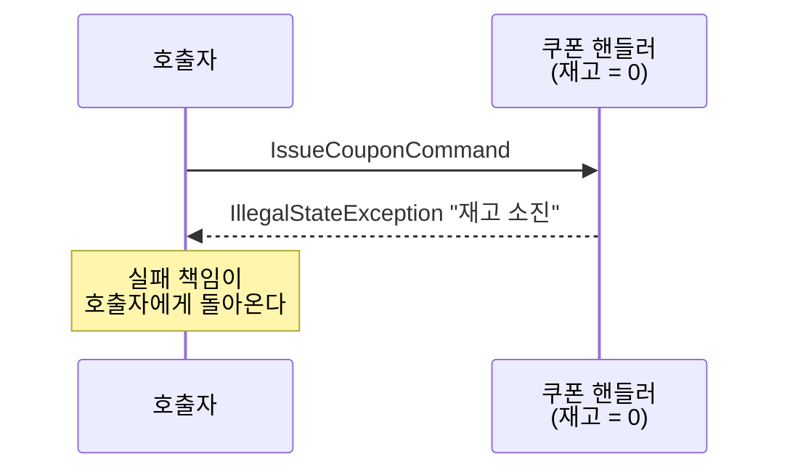
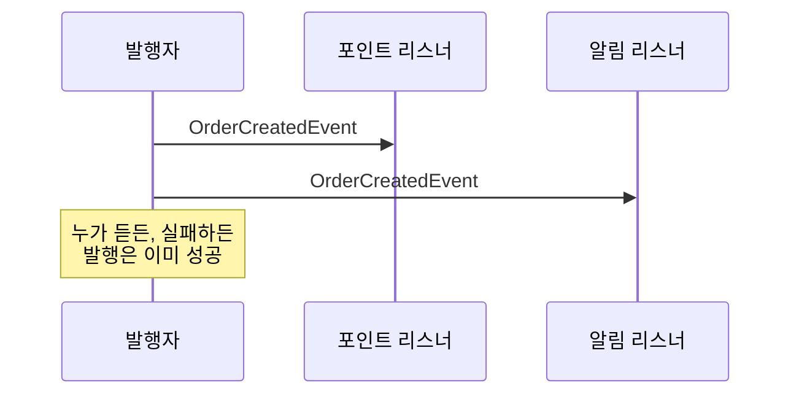
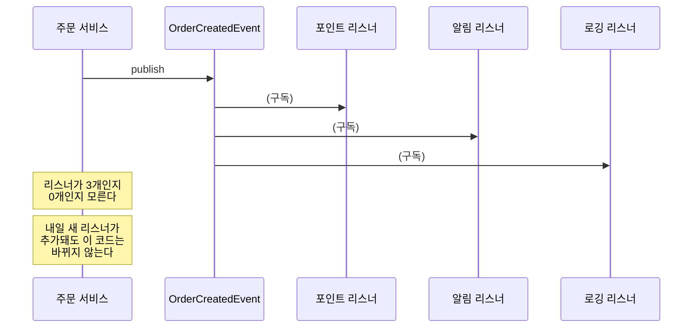
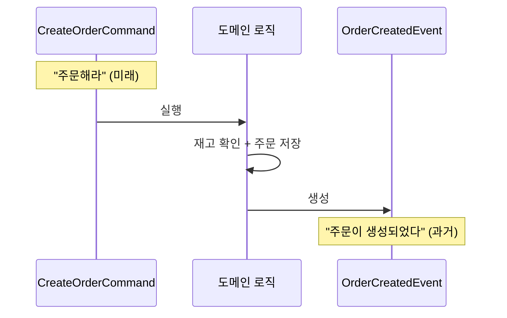

# Step 0 — Command vs Event

---

## 하나의 주문에서 시작하자

주문 생성 플로우를 떠올려보자. 사용자가 "주문하기" 버튼을 누르면 서버에서 이런 일이 벌어진다.

```
1. 재고 차감
2. 쿠폰 사용
3. 결제 요청
4. 주문 저장
5. 포인트 적립
6. 알림 발송
```

여섯 가지 작업이다. 전부 "주문"이라는 행위에 뒤따르는 작업이다.

그런데 여기서 질문 하나.

> **이 여섯 가지가 전부 같은 성격의 작업인가?**

"재고 차감"과 "알림 발송"이 같은 무게인가?
"쿠폰 사용"과 "포인트 적립"이 같은 긴급도인가?

직관적으로 아니라는 걸 안다. 근데 **왜** 다른지를 정확히 말하기가 어렵다.
이 Step에서 그 "왜"를 잡는다.

---

## "~해라"와 "~가 일어났다"

여섯 가지 작업을 다시 보자. 이번에는 **말투**에 주목해서.

```
"재고를 차감해라"
"쿠폰을 사용해라"
"결제를 요청해라"
"주문을 저장해라"
```

여기까지는 전부 **"~해라"**다. 아직 안 일어난 일이고, 실패할 수 있다.

```
"주문이 생성되었다"
```

이건 **"~되었다"**다. 이미 일어난 사실이고, 되돌릴 수 없다.

그러면 "포인트를 적립해라"와 "주문이 생성되었다"는 뭐가 다른가?

```
"포인트를 적립해라"      ← 누군가에게 시키는 것
"주문이 생성되었다"      ← 누가 듣든 상관없이 사실을 알리는 것
```

전자가 **Command**고, 후자가 **Event**다.

---

## Command에는 없고 Event에는 있는 것

코드로 보면 차이가 선명해진다.

```java
class IssueCouponCommand {
    Long userId;
    String couponType;
    // occurredAt? → 없다. 아직 안 일어났으니까.
}

class OrderCreatedEvent {
    Long orderId;
    BigDecimal amount;
    Instant occurredAt;   // 반드시 있다. 언제 일어났는지가 사실의 일부니까.
}
```

`occurredAt`의 유무가 단순한 필드 차이가 아니다.
**이 객체가 담고 있는 것이 "의도"인지 "사실"인지**를 구분하는 표식이다.

> **CommandEventConceptTest** — `Command는_미래시제다_아직_일어나지_않은_일()`과
> `Event는_과거시제다_이미_확정된_사실()`에서 이 구조적 차이를 직접 확인할 수 있다.

이게 나중에 왜 중요해지는가?

Event를 DB에 저장할 때(Step 3 Event Store), `occurredAt`은 순서 판단의 기준이 된다.
Kafka 토픽에서 이벤트를 재처리할 때(Step 5), "이 이벤트가 저 이벤트보다 먼저 일어났는가?"를 `occurredAt`으로 판단한다.
Command에는 이 필드가 없으니까 저장/재처리의 대상이 아니다.

---

## 실패하면 누가 책임지는가

Command와 Event의 가장 실무적인 차이는 여기서 나온다.

쿠폰 재고가 0인 상황에서 Command를 실행하면:

```java
handler.handle(new IssueCouponCommand(userId, "WELCOME"));
// → IllegalStateException: "재고 소진"
// → 이 예외를 호출자가 처리해야 한다.
```



이미 일어난 사실을 Event로 발행하면:

```java
publisher.publishEvent(new OrderCreatedEvent(orderId, amount, now));
// → 리스너가 0개여도 발행은 성공한다.
// → 리스너가 예외를 던져도 "주문이 생성되었다"는 사실은 변하지 않는다.
```



> **CommandEventBehaviorTest** — `Command는_실패할_수_있고_발신자가_처리해야_한다()`와
> `Event는_이미_일어난_사실이므로_발행_자체는_실패하지_않는다()`에서 확인할 수 있다.

이 차이가 설계 판단을 가른다.

> "쿠폰 사용이 실패하면 주문도 실패해야 하는가?"
> → Yes면 Command로 동기 처리해야 한다.
>
> "포인트 적립이 실패해도 주문은 유지해야 하는가?"
> → Yes면 Event로 분리해도 된다.

---

## 그러면 누가 듣는지는 왜 상관없는가

Command는 수신자를 지정한다. "쿠폰 서비스야, 이 쿠폰 사용해."

```java
class OrderService {
    private final CouponService couponService;   // 직접 알고 있다

    void createOrder(...) {
        couponService.useCoupon(couponId);        // "너가 해"
    }
}
```

Event는 수신자를 모른다. "주문이 생성됐어. 알아서 해."

```java
class OrderService {
    private final ApplicationEventPublisher publisher;

    void createOrder(...) {
        publisher.publishEvent(OrderCreatedEvent.from(order));
        // 누가 듣든 내 알 바 아님
    }
}
```



> **CommandEventConceptTest** — `Command는_수신자를_특정한다_1대1()`과
> `Event는_수신자를_모른다_1대N()`에서 확인할 수 있다.

이게 Step 1에서 "직접 호출 → 이벤트 전환"을 하면 **의존성이 4개에서 1개로 줄어드는** 이유다.

---

## Command 실행 결과가 Event가 된다

여기까지 읽으면 한 가지 의문이 생긴다.

> "그러면 Command와 Event가 완전히 별개인가?"

아니다. 같은 도메인 안에서 **Command → 실행 → Event**라는 흐름이 존재한다.

```
CreateOrderCommand  →  (도메인 로직 실행)  →  OrderCreatedEvent
     "주문해라"          재고 확인, 저장         "주문이 생성되었다"
      미래형                현재                    과거형
```



```java
@Transactional
void handle(CreateOrderCommand cmd) {
    // Command를 받아서 실행한다 (미래 → 현재)
    Order order = Order.create(cmd.userId(), cmd.productId(), cmd.quantity());
    orderRepository.save(order);

    // 실행 결과를 Event로 발행한다 (현재 → 과거 확정)
    publisher.publishEvent(OrderCreatedEvent.from(order));
}
```

> **CommandEventBehaviorTest** — `같은_도메인에서_Command_실행_결과가_Event가_된다()`에서
> 이 흐름을 따라가볼 수 있다.

이 흐름이 중요한 이유는 Step 3과 Step 5에서 돌아오기 때문이다.

```
Step 3: 도메인 저장 + 이벤트 기록을 같은 TX로 묶자 (Event Store)
Step 5: 릴레이가 Event Store → Kafka로 발행하자 (Outbox)
```

**Command 실행 결과로 만들어진 Event를 DB에 저장하고, 그걸 외부로 전달하는** 것이
Transactional Outbox Pattern의 본질이다. 그 출발점이 여기다.

---

## 다시 처음으로 — 여섯 가지 작업을 분류해보자

이제 처음에 던진 질문으로 돌아가자.

```
1. 재고 차감
2. 쿠폰 사용
3. 결제 요청
4. 주문 저장
5. 포인트 적립
6. 알림 발송
```

각 작업에 세 가지 질문을 던져보자.

> **Q1. 이 작업이 실패하면 주문도 실패해야 하는가?**
> **Q2. 이 작업의 실행 순서가 주문 흐름에서 중요한가?**
> **Q3. 사용자 응답에 이 작업의 결과가 포함돼야 하는가?**

직접 채워보자. 아래 테이블을 보기 전에 먼저 자기 답을 적어보자.

<details>
<summary><b>답 확인</b></summary>

| 작업 | Q1. 실패 시 주문 실패? | Q2. 순서 중요? | Q3. 응답에 포함? | 판단 |
|------|:---:|:---:|:---:|------|
| 재고 차감 | Yes | Yes | Yes | **Command** |
| 쿠폰 사용 | Yes | No | Yes (할인 금액) | **Command** |
| 결제 요청 | Yes | Yes | Yes (결제 결과) | **Command** |
| 주문 저장 | Yes | — | Yes | **핵심 TX** |
| 포인트 적립 | No | No | No | **Event** |
| 알림 발송 | No | No | No | **Event** |

**세 질문에 하나라도 Yes가 있으면 Command(동기, 같은 TX).**
**전부 No이면 Event(비동기, 별도 TX)로 분리할 수 있다.**

</details>

이 판단 기준은 이후 Step에서 "뭘 이벤트로 분리하는가"를 결정할 때 계속 돌아온다.

---

## 왜 이걸 먼저 다루는가

이 구분 없이 Step 5(Kafka)로 가면, 토픽 이름에서부터 혼란이 시작된다.

```
coupon-issue-requests  ← 이건 Command 토픽이다. "쿠폰을 발급해라."
order-events           ← 이건 Event 토픽이다. "주문이 생성되었다."
```

같은 Kafka인데 **토픽의 성격이 다르다.** Command 토픽은 수신자가 반드시 처리해야 하고, Event 토픽은 아무도 안 들어도 된다. 이 구분을 모르면 모든 토픽을 같은 방식으로 설계하게 되고, 그게 장애의 시작이다.

---

## 스스로 답해보자

테스트를 실행하기 전에 먼저 답해보고, 테스트로 자기 답을 검증하자.

- Command에 `occurredAt`이 없는 이유를 한 문장으로 설명할 수 있는가?
- Event 발행 시 리스너가 0개인데 왜 에러가 아닌가?
- "쿠폰 사용 실패 → 주문 롤백"이 맞다면, 쿠폰 사용은 Command인가 Event인가?
- "포인트 적립 실패 → 주문 유지"가 맞다면, 포인트 적립은 Command인가 Event인가?
- `coupon-issue-requests`와 `order-events`라는 토픽 이름이 왜 다른 형태인가?

> 답이 바로 나오면 Step 1로 넘어가자.
> 막히면 `CommandEventConceptTest`와 `CommandEventBehaviorTest`를 실행해서 확인하자.

---

## 다음 Step으로

이 Step에서 "뭘 분리할 수 있는가"의 판단 기준을 세웠다.
하지만 실제로 이벤트로 분리하면 **어떤 일이 생기는지**는 아직 모른다.

Step 1에서는 직접 호출 방식의 결합도 문제를 체험하고,
`ApplicationEvent`로 전환한 뒤 의존성이 어떻게 변하는지 확인한다.
그리고 **이벤트로 분리했을 때 생기는 첫 번째 문제**를 만난다.