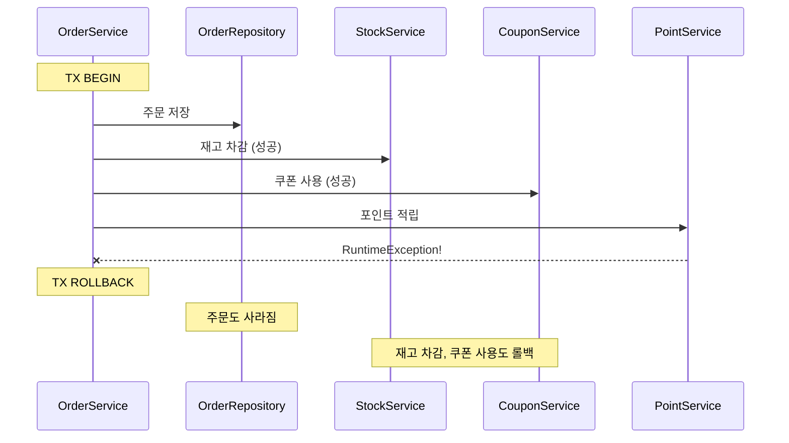
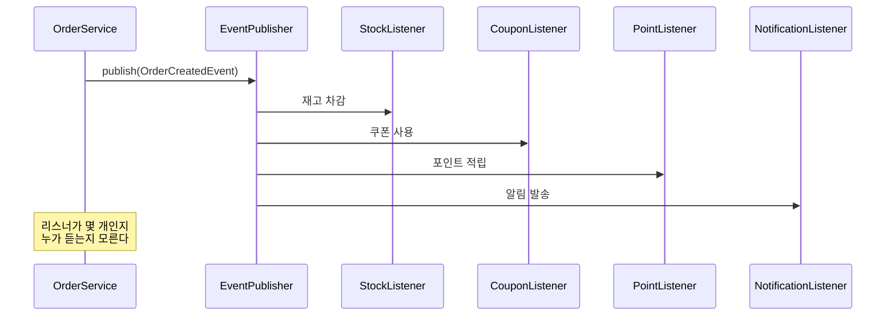
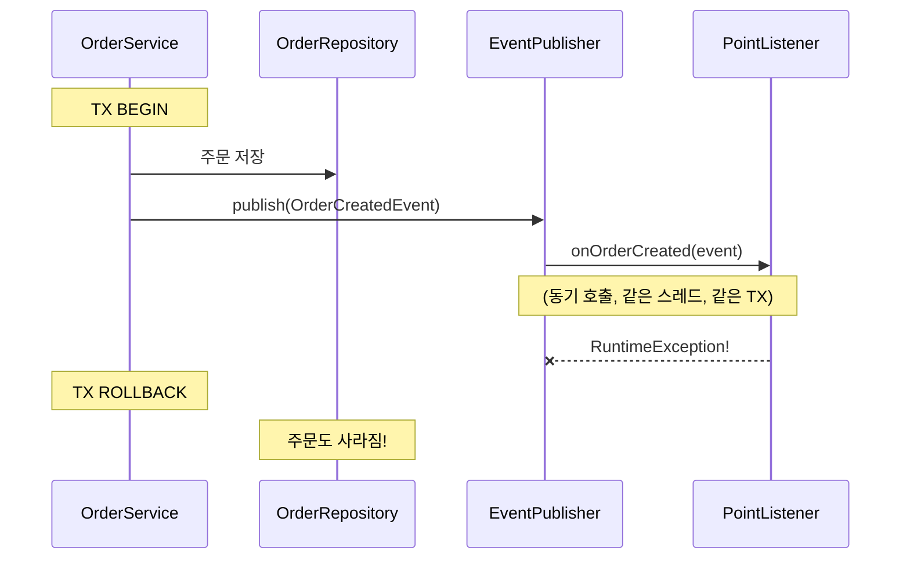

# Step 1 — Application Event

---

## 직접 호출의 문제를 먼저 느껴보자

Step 0에서 "뭘 Command로 두고 뭘 Event로 뺄 것인가"의 판단 기준을 세웠다. 이제 실제로 코드에서 어떤 문제가 생기는지 보자.

주문 서비스를 직접 호출 방식으로 구현하면 이렇게 된다.

```java
class DirectOrderService {
    private final OrderRepository orderRepository;
    private final StockService stockService;
    private final CouponService couponService;
    private final PointService pointService;

    void createOrder(...) {
        orderRepository.save(order);
        stockService.deduct(productId, quantity);
        couponService.useCoupon(couponId);
        pointService.record(orderId, amount);
    }
}
```

생성자 파라미터가 4개다. OrderService가 StockService, CouponService, PointService를 **전부 알고 있다.**

> **DirectCallCouplingTest** — `직접_호출_방식에서_OrderService는_모든_후속_서비스에_의존한다()`에서
> 리플렉션으로 생성자 파라미터 수를 확인한다.

여기까진 "좀 많네" 정도다. 진짜 문제는 다음이다.

---

## 포인트 적립이 실패하면 주문이 취소된다

PointService에서 예외가 발생하는 상황을 만들어보자.



포인트 적립이 실패했을 뿐인데, **주문까지 롤백됐다.**

(이 예제는 전부 같은 DB 트랜잭션 안이라 롤백이 가능하다. 만약 StockService가 외부 API를 호출하는 구조라면, DB는 롤백되지만 외부 호출은 되돌릴 수 없다 — Step 0에서 "결제는 비가역적 부수효과"라고 한 이유다.)

이게 우리가 원한 건가? Step 0에서 정리한 판단 기준을 떠올려보자.

> "포인트 적립이 실패해도 주문은 유지해야 하는가?" → Yes

그렇다면 포인트 적립 실패가 주문을 롤백시키면 안 된다.
근데 직접 호출 방식에서는 **같은 트랜잭션 안에서 실행되니까 막을 방법이 없다.**

> **DirectCallCouplingTest** — `직접_호출_방식에서_후속_처리_실패시_주문도_롤백된다()`에서 확인.

(물론 모든 후속 처리가 성공하면 주문은 정상 완료된다.)

> **DirectCallCouplingTest** — `직접_호출_방식에서_모든_후속_처리가_성공하면_주문이_완료된다()`에서 정상 흐름을 확인.

---

## ApplicationEvent로 끊어보자

`ApplicationEventPublisher`를 쓰면 OrderService가 후속 서비스를 직접 알 필요가 없어진다.

```java
class EventedOrderService {
    private final OrderRepository orderRepository;
    private final ApplicationEventPublisher publisher;   // 이것만 안다

    void createOrder(...) {
        orderRepository.save(order);
        publisher.publishEvent(OrderCreatedEvent.from(order));
        // 누가 듣든 내 알 바 아님
    }
}
```

생성자 파라미터가 4개에서 2개로 줄었다. **StockService, CouponService, PointService에 대한 의존이 사라졌다.**



> **ApplicationEventDecouplingTest** — `이벤트_방식에서_OrderService는_EventPublisher에만_의존한다()`에서 확인.

이벤트 발행 후 리스너가 정상 처리하면 모든 후속 데이터가 저장된다.

> **ApplicationEventDecouplingTest** — `이벤트_발행_후_리스너가_정상_처리하면_모든_데이터가_저장된다()`에서 정상 흐름을 확인.

내일 알림 서비스를 추가해도 OrderService 코드는 한 줄도 안 바뀐다. 리스너만 하나 더 만들면 된다.

> **ApplicationEventDecouplingTest** — `후속_로직_추가시_OrderService는_수정하지_않아도_된다()`에서 확인.

좋다. 문제가 해결된 것 같다.

**정말?**

---

## 이벤트로 끊었는데 같은 문제가 생긴다

PointEventListener에서 예외가 발생하는 상황을 만들어보자.



**직접 호출 때와 똑같은 문제다.** 이벤트로 끊었는데 왜?

발행자가 `@Transactional` 안에서 이벤트를 발행하면, **`@EventListener`는 그 트랜잭션 컨텍스트에 참여한다.** 같은 스레드, 같은 TX. 리스너가 별도 트랜잭션을 시작하는 게 아니라, 발행자의 TX를 그대로 공유하는 것이다.

```java
@EventListener    // ← 동기적. 같은 스레드. 같은 TX.
void onOrderCreated(OrderCreatedEvent event) {
    pointService.record(event.orderId(), event.amount());
    // 여기서 예외가 터지면 → 발행자의 TX도 롤백
}
```

> **EventListenerExceptionTest** — `리스너_예외가_발행자_트랜잭션을_롤백시킨다()`에서 확인.
> **EventListenerExceptionTest** — `EventListener는_발행자와_같은_스레드에서_동기적으로_실행된다()`에서 확인.

이벤트로 "형태"는 분리했지만, "실행"은 분리하지 못한 것이다.
결합도는 줄었지만, **장애 전파는 그대로다.**

이 한계가 Step 2로 넘어가는 이유다.

---

## 잠깐 — 여기서 흔히 밟는 함정이 있다

Step 0에서 Command와 Event를 구분하는 법을 배웠고, 이 Step에서 ApplicationEvent로 분리하는 법을 배웠다. 이 시점에서 많은 사람이 이런 실수를 한다.

> "이벤트로 분리하면 결합도가 낮아진다고 했으니, 전부 이벤트로 바꾸자!"

```java
void createOrder(...) {
    orderRepository.save(order);
    publisher.publishEvent(new InventoryDeductEvent(productId, quantity));
    publisher.publishEvent(new CouponUseEvent(couponId));
    publisher.publishEvent(new PaymentRequestEvent(orderId, amount));
    publisher.publishEvent(new OrderCreatedEvent(orderId, amount, now));
}
```

`ApplicationEvent`로 발행했으니까 전부 이벤트인가?

**아니다.** 이름을 다시 보자.

```
InventoryDeductEvent  → "재고를 차감해라"    → 이건 Command다
CouponUseEvent        → "쿠폰을 사용해라"    → 이건 Command다
PaymentRequestEvent   → "결제를 요청해라"    → 이건 Command다
OrderCreatedEvent     → "주문이 생성되었다"   → 이건 Event다
```

앞의 세 개는 **"~해라"**다. 실패하면 주문이 깨진다. 수신자가 반드시 처리해야 한다. **메시지의 성격이 Command면, 어떤 도구로 보내든 Command다.**

`ApplicationEvent`로 발행했다고 Event가 되는 게 아니다. `Kafka`로 보내도 마찬가지다. **도구가 메시지의 성격을 바꾸지 않는다.**

이벤트 이름도 마찬가지다. 이름이 **"~해라"**면 Command다.

```
잘못된 이름 (사실상 Command):
  CreateNotificationEvent    → "알림을 만들어라"
  DecreaseInventoryEvent     → "재고를 줄여라"
  InventoryDeductEvent       → "재고를 차감해라"

올바른 이름 (진짜 Event):
  OrderCreated               → "주문이 생성되었다"
  OrderCompleted             → "주문이 완료되었다"
  OrderCancelled             → "주문이 취소되었다"
```

이벤트는 **"누가 무엇을 해라"가 아니라 "무슨 일이 일어났는가"**를 표현해야 한다. 그래야 알림 서비스는 알림을, 재고 서비스는 재고 차감을, 각자 독립적으로 반응할 수 있다.

### 그러면 올바른 최종 형태는?

Step 0의 판단 기준을 다시 꺼내보자.

> "이 작업이 실패하면 주문도 실패해야 하는가?"

- 재고 차감 실패 → 주문 실패해야 함 → **Command. 동기 호출이 맞다.**
- 쿠폰 사용 실패 → 주문 실패해야 함 → **Command. 동기 호출이 맞다.**
- 결제 요청 실패 → 주문 실패해야 함 → **Command. 동기 호출이 맞다.**
- 포인트 적립 실패 → 주문 유지해야 함 → **Event. 분리해도 된다.**

**전부 이벤트로 바꾸는 게 아니라, Event인 것만 이벤트로 분리하는 것이다.**

```java
void createOrder(CreateOrderCommand cmd) {
    // Command — 동기, 같은 TX
    stockService.deduct(cmd.productId(), cmd.quantity());
    couponService.useCoupon(cmd.couponId());
    Order order = orderRepository.save(...);

    // Event — 비동기, 별도 TX (Step 2에서)
    publisher.publishEvent(OrderCreatedEvent.of(order.getId(), order.getUserId(), order.getAmount()));
}
```

이 최종 형태에서 생성자 파라미터를 세어보자. `OrderRepository`, `StockService`, `CouponService`, `ApplicationEventPublisher` — **4개다.** 앞에서 "2개로 줄었다"고 했는데, 그건 전부 이벤트로 발행한 중간 단계의 이야기다. Command인 작업(재고, 쿠폰)은 직접 의존이 남아야 하니까, **최종 의존성은 4개다.** 줄어든 건 PointService 하나뿐이고, 대신 EventPublisher가 들어왔다.

그러면 "2개로 줄었다"는 뭐였나? **"전부 이벤트로 바꾸면 이렇게 깔끔해진다"는 유혹을 먼저 보여주고, "근데 그러면 안 된다"를 교정한 것이다.** 결합도 개선은 "Event인 것만 분리"하는 데서 오는 것이지, 전부 이벤트로 바꾸는 데서 오는 게 아니다.

이 구분을 못 하면, "이벤트 기반 아키텍처"라는 이름 아래 **모든 호출을 이벤트로 감싸고, 정작 장애가 나면 "왜 재고가 안 차감됐지?" "왜 결제가 안 됐지?"를 추적할 수 없는** 상황이 된다.

---

## 이 Step에서 일어난 일을 정리하면

```
직접 호출:
  ✅ 명확한 흐름
  ❌ 의존성 4개 (모든 후속 서비스를 직접 참조)
  ❌ 포인트 실패 → 주문 롤백

ApplicationEvent (전부 이벤트로 발행한 버전):
  ✅ 의존성 2개 (OrderRepo + EventPublisher)
  ✅ 리스너 추가로 확장 (OCP)
  ❌ @EventListener가 같은 TX에서 실행 → 리스너 실패 시 발행자 TX 롤백
  ❌ 전부 이벤트로 바꾸면 Command까지 이벤트가 되는 함정

올바른 최종 형태 (Command는 직접, Event만 분리):
  의존성 4개 (OrderRepo + Stock + Coupon + EventPublisher)
  PointService 의존만 제거됨 — 극적인 감소가 아니라 적절한 분리
  ❌ 이벤트가 메모리에만 존재 — 서버가 죽으면 사라진다 → Step 3으로
```

---

## 스스로 답해보자

- 직접 호출에서 생성자 의존성이 4개인 이유는?
- 전부 이벤트로 발행하면 2개로 줄어드는데, 왜 그 상태가 최종 답이 아닌가?
- 올바른 최종 형태에서 의존성이 다시 4개인 이유는?
- 리스너를 추가할 때 OrderService를 수정해야 하는가?
- `@EventListener`에 `@Transactional`이 없어도 예외가 발생하면 왜 주문까지 롤백되는가?
- `InventoryDeductEvent`라는 이름이 왜 잘못된 것인가?
- "전부 이벤트로 바꾸자"가 왜 위험한가?

> 답이 바로 나오면 Step 2로 넘어가자.
> 막히면 `DirectCallCouplingTest`, `ApplicationEventDecouplingTest`, `EventListenerExceptionTest`를 실행해서 확인하자.

---

## 다음 Step으로

`@EventListener`는 발행자와 **같은 스레드, 같은 트랜잭션**에서 실행된다.
그래서 리스너 예외가 발행자 TX를 롤백시킨다.

이 문제를 해결하려면 **"트랜잭션이 커밋된 후에만 실행"**되게 해야 한다.
Step 2에서 `@TransactionalEventListener`의 phase를 배우고,
`@Async`로 별도 스레드로 분리하면서 **또 다른 문제**를 만난다.