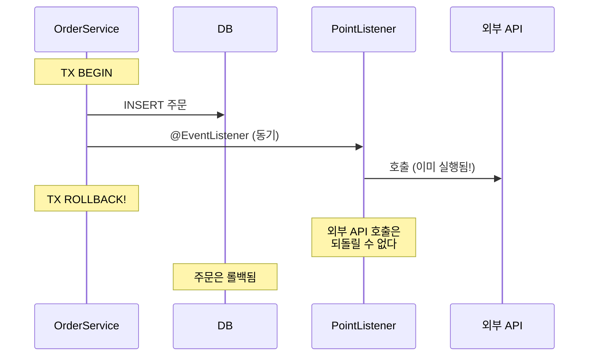
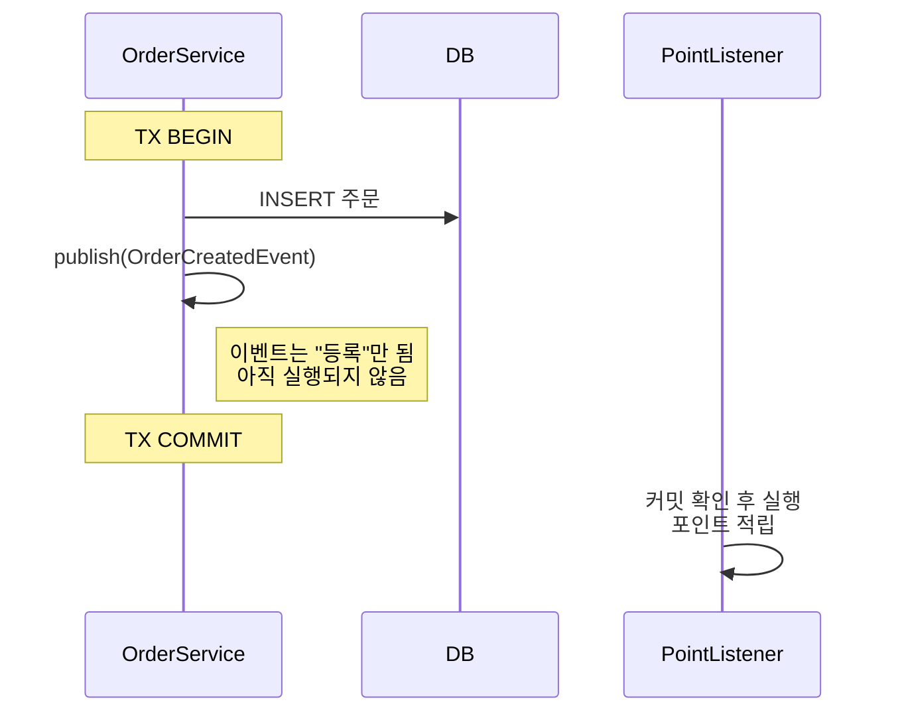
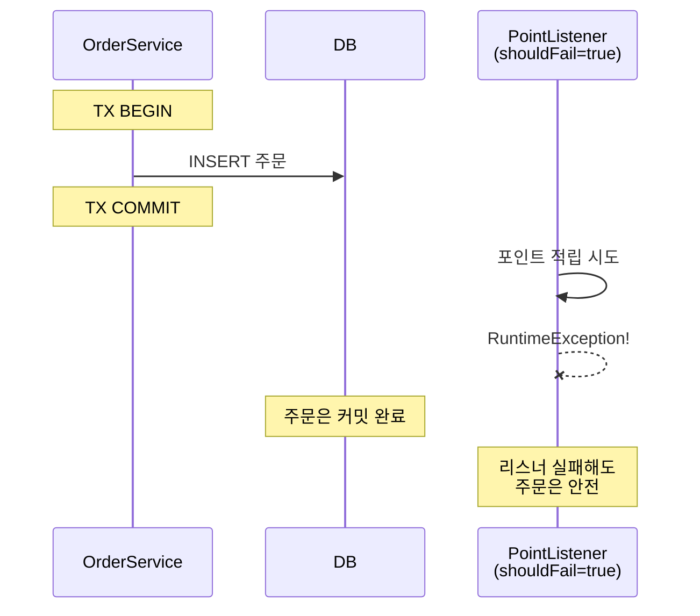
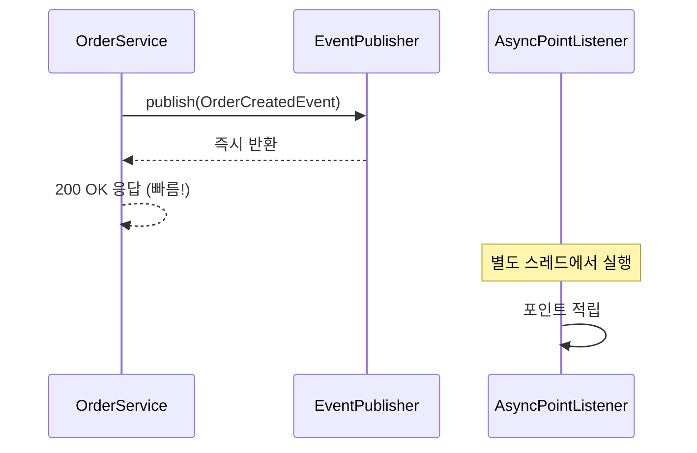
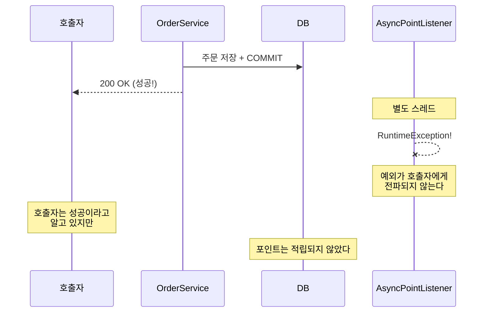
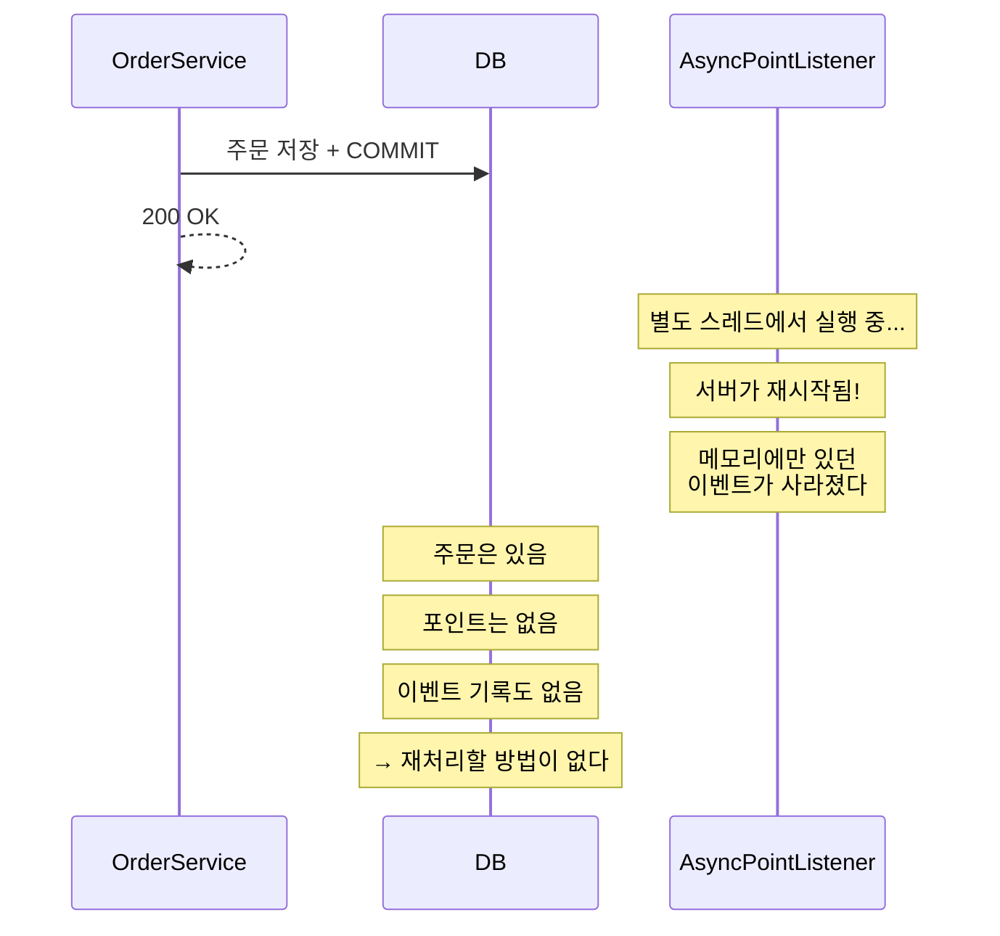

# Step 2 — Transactional Event

---

## Step 1의 한계에서 시작하자

Step 1에서 `@EventListener`의 문제를 확인했다.

```
리스너가 발행자와 같은 스레드, 같은 트랜잭션에서 실행된다.
→ 리스너 예외가 발행자 TX를 롤백시킨다.
→ 포인트 적립 실패 때문에 주문이 취소된다.
```

해결하려면 **"트랜잭션이 커밋된 후에만 리스너를 실행"**하면 된다.
Spring이 이걸 위해 `@TransactionalEventListener`를 제공한다.

근데 이게 단순하지 않다. phase가 4개고, `@Async`를 붙이면 또 다른 문제가 생기고, 곳곳에 함정이 숨어있다.

---

## 먼저 — @EventListener가 커밋 전에 실행되면 뭐가 위험한가

Step 1에서는 "리스너 예외 → 발행자 TX 롤백"을 봤다. 롤백 문제에 더해, 커밋 전 실행이 만드는 또 다른 위험이 있다.

리스너에서 **외부 API를 호출**하는 경우를 생각해보자.



주문은 롤백됐는데 외부 API는 이미 호출됐다. 포인트가 이미 적립됐거나, 알림이 이미 발송됐다. **트랜잭션 밖의 부수효과는 되돌릴 수 없다.**

> **EventListenerTimingTest** — `EventListener는_커밋_전에_실행되어_롤백시_부수효과가_되돌려지지_않는다()`에서 확인.

이래서 "커밋 후에만 실행"이 필요한 거다. 커밋이 확정된 후에야 외부 API를 호출해도 안전하다.

---

## @TransactionalEventListener — 커밋 후에만 실행

`@TransactionalEventListener(phase = AFTER_COMMIT)`을 쓰면, 트랜잭션이 커밋된 후에만 리스너가 실행된다.

```java
@TransactionalEventListener(phase = AFTER_COMMIT)
void onOrderCreated(OrderCreatedEvent event) {
    pointService.record(event.orderId(), event.amount());
}
```



> **TransactionalEventListenerTest** — `TransactionalEventListener는_커밋_후에만_실행된다()`에서 확인.

트랜잭션이 롤백되면? 리스너가 **실행되지 않는다.** 커밋이 안 됐으니까.

> **TransactionalEventListenerTest** — `트랜잭션이_롤백되면_TransactionalEventListener는_실행되지_않는다()`에서 확인.

그리고 Step 1의 핵심 한계였던 "리스너 예외 → 발행자 TX 롤백" 문제가 해결된다. **이미 커밋된 후니까 리스너 예외가 발행자 TX에 영향을 줄 수 없다.**



> **TransactionalEventListenerTest** — `TransactionalEventListener_예외는_발행자_트랜잭션에_영향을_주지_않는다()`에서 확인.

---

## 잠깐 — AFTER_COMMIT만 있는 게 아니다

`@TransactionalEventListener`에는 phase가 4개다. AFTER_COMMIT만 쓰기 전에 전부 알아야 한다.

```
BEFORE_COMMIT   → 커밋 직전에 실행. TX 안에서 실행된다.
AFTER_COMMIT    → 커밋 후에 실행. TX 밖에서 실행된다.
AFTER_ROLLBACK  → 롤백 후에 실행.
AFTER_COMPLETION → 커밋이든 롤백이든 무관하게 실행.
```

왜 이걸 알아야 하는가? **BEFORE_COMMIT은 Step 1과 같은 위험을 가지고 있기 때문이다.**

```java
@TransactionalEventListener(phase = BEFORE_COMMIT)
void onOrderCreated(OrderCreatedEvent event) {
    // 이 안에서 예외가 터지면?
    pointService.record(event.orderId(), event.amount());
}
```

BEFORE_COMMIT은 아직 TX 안이다. 여기서 예외가 터지면 **발행자 TX가 롤백된다.** `@EventListener`와 같은 문제다. `@TransactionalEventListener`를 썼다고 안전한 게 아니다. **phase가 AFTER_COMMIT이어야 안전한 것이다.**

> **TransactionalEventListenerPhaseTest** — `BEFORE_COMMIT_리스너에서_예외_발생_시_발행자_TX가_롤백된다()`에서 확인.

그러면 AFTER_ROLLBACK과 AFTER_COMPLETION은 언제 쓰는가?

```
AFTER_ROLLBACK: "주문이 실패했으니 슬랙에 알림을 보내자" — 롤백 후 보상/알림용
AFTER_COMPLETION: "성공이든 실패든 임시 파일을 정리하자" — 리소스 정리용
```

> **TransactionalEventListenerPhaseTest** — `AFTER_ROLLBACK_리스너는_롤백_후에만_실행된다()`, `AFTER_COMPLETION_리스너는_커밋_롤백_무관하게_실행된다()`에서 확인.

---

## @Async — 응답 속도를 올리자

AFTER_COMMIT으로 안전한 타이밍을 확보했다. 근데 아직 **동기 실행**이다.
포인트 적립에 500ms가 걸리면, 사용자 응답도 500ms 느려진다.

`@Async`를 붙이면 리스너가 별도 스레드에서 실행된다.

```java
@TransactionalEventListener(phase = AFTER_COMMIT)
@Async
void onOrderCreated(OrderCreatedEvent event) {
    pointService.record(event.orderId(), event.amount());
}
```



> **AsyncEventTest** — `Async_리스너는_별도_스레드에서_실행되어_응답이_빠르다()`에서 확인.

좋다. 빠르다. **하지만.**

---

## @Async의 대가 — 실패가 보이지 않는다

별도 스레드에서 실행되니까, 리스너에서 예외가 터져도 **호출자에게 전파되지 않는다.**



> **AsyncEventTest** — `Async_리스너_예외는_호출자에게_전파되지_않는다_실패가_숨겨진다()`에서 확인.

호출자는 200 OK를 받았다. 사용자도 "주문 완료" 화면을 봤다. **하지만 포인트는 적립되지 않았다.** 호출자 코드에서는 이 실패를 감지할 수 없다 — 다른 스레드니까 try-catch로 잡을 수 없다. `@Async` 영역은 로깅과 모니터링(`AsyncUncaughtExceptionHandler`, Sentry 등)을 별도로 구성해야 운영 레벨에서 실패를 감지할 수 있다. 그게 없으면 고객이 "포인트가 왜 안 들어왔어요?"라고 문의하기 전까지 아무도 모른다.

이게 **실패 은닉(Failure Hiding)** 문제다.

---

## 그리고 이건 Eventual Consistency다

`@Async`를 쓰는 순간, 주문 저장과 포인트 적립 사이에 **시간 차**가 생긴다.

```java
orderService.createOrder(command);   // 주문 저장 완료

// 이 시점에 포인트를 조회하면?
Point point = pointRepository.findByUserId(userId);
// → null일 수 있다. 비동기 스레드가 아직 안 돌았으니까.
```

주문 직후에 포인트를 조회하면 아직 반영 안 됐을 수 있다. 이건 **버그가 아니라 설계 결정**이다. AFTER_COMMIT + @Async를 선택한 순간, **즉시 일관성을 포기하고 최종 일관성(Eventual Consistency)을 수용한 것이다.**

Eventual Consistency를 수용했다는 건 쓰기만 비동기로 바꾸면 끝이 아니라, **읽기 측에서도 대응해야 한다**는 뜻이다. 주문 완료 직후 마이페이지에서 포인트를 보여줘야 한다면, UI에서 "포인트 적립 예정" 표시를 하거나, 클라이언트 측 낙관적 업데이트를 쓰거나, polling으로 반영 시점을 확인하는 등의 전략이 필요하다.

> **EventualConsistencyTest** — `주문_직후_포인트를_조회하면_아직_반영되지_않았을_수_있다()`에서 확인.

---

## 여기서 밟는 함정 네 가지

AFTER_COMMIT + @Async까지 왔으면 기본 구조는 잡힌 거다. 근데 실제로 코드를 짜면 밟게 되는 함정이 있다.

### 함정 1: 트랜잭션 없이 이벤트를 발행하면 리스너가 안 불린다

```java
// @Transactional이 없다!
void createOrder(...) {
    orderRepository.save(order);
    publisher.publishEvent(OrderCreatedEvent.of(order.getId(), userId, order.getAmount()));
}
```

`@TransactionalEventListener`는 **트랜잭션의 커밋/롤백을 감지해서 실행**된다. 트랜잭션 자체가 없으면 커밋도 롤백도 없으니까, 리스너가 **아예 불리지 않는다.** 에러도 안 난다. 조용히 무시된다.

> **TransactionalEventTrapTest** — `트랜잭션_없이_이벤트를_발행하면_TransactionalEventListener가_불리지_않는다()`에서 확인.

이걸 모르면 "리스너를 등록했는데 왜 안 불리지?" 삽질을 한다. `@Transactional`을 빠뜨린 것뿐인데.

### 함정 2: @EnableAsync 없이 @Async를 달면 동기로 실행된다

```java
// @EnableAsync가 설정 클래스에 없다!
@Async
@TransactionalEventListener(phase = AFTER_COMMIT)
void onOrderCreated(OrderCreatedEvent event) {
    // "비동기인 줄 알았는데 동기로 도는 거야?"
}
```

Spring이 `@Async`를 처리하려면 `@EnableAsync`가 필요하다. 없으면 `@Async`가 **조용히 무시**된다. 경고도 에러도 없이 동기로 실행된다.

> **TransactionalEventTrapTest** — `EnableAsync가_있어야_Async_리스너가_별도_스레드에서_실행된다()`에서 확인.

### 함정 3: AFTER_COMMIT 리스너에서 DB 저장이 실패한다

```java
@TransactionalEventListener(phase = AFTER_COMMIT)
void onOrderCreated(OrderCreatedEvent event) {
    Point point = new Point(event.userId(), event.amount());
    pointRepository.save(point);
}
```

AFTER_COMMIT 리스너는 기존 TX가 커밋된 후 실행된다. 이 시점에서 새로운 DB 쓰기를 하려면 새 트랜잭션이 필요한데, 기존 트랜잭션 동기화 컨텍스트 안에서는 새 TX가 정상적으로 열리지 않을 수 있다. `save()` 내부의 `@Transactional`이 이미 커밋된 TX에 참여하려다가 실패하거나, 영속성 컨텍스트가 닫힌 상태라 예외가 발생한다.

해결하려면 **별도 빈에서 `REQUIRES_NEW`로 명시적으로 새 TX를 열어야 한다.** 같은 클래스에서 `@Transactional(REQUIRES_NEW)`를 달아도 **self-invocation**(같은 객체 내부에서 메서드를 호출하면 프록시를 거치지 않아 AOP가 동작하지 않는 현상) 때문에 프록시를 타지 않으니까, 반드시 별도 빈으로 분리해야 한다.

```java
// 별도 빈
@Service
class PointRecorder {
    @Transactional(propagation = Propagation.REQUIRES_NEW)
    public void record(String userId, long amount) {
        pointRepository.save(new Point(userId, amount));
    }
}

// 리스너
@TransactionalEventListener(phase = AFTER_COMMIT)
void onOrderCreated(OrderCreatedEvent event) {
    pointRecorder.record(event.userId(), event.amount());  // 별도 빈 호출
}
```

> **TransactionalEventTrapTest** — `AFTER_COMMIT_리스너에서_DB_저장하면_TransactionRequiredException_발생()`과
> `AFTER_COMMIT_리스너에서_별도_빈의_REQUIRES_NEW로_새_TX를_열면_DB_저장_가능()`에서 확인.

### 함정 4: @Async 기본 스레드풀 설정은 프로덕션에 부적합하다

Spring Boot에서는 `@EnableAsync`를 설정하면 `applicationTaskExecutor`라는 `ThreadPoolTaskExecutor`가 자동 등록된다. (Raw Spring이면 `SimpleAsyncTaskExecutor`가 기본이라 스레드를 무한 생성하지만, Spring Boot에서는 이 문제는 없다.)

그래도 기본 설정(corePoolSize=8, 큐 제한 없음)을 그대로 프로덕션에서 쓰면 위험하다. 이벤트가 대량으로 발생할 때 큐가 무한히 쌓이거나, 스레드 수가 요구에 비해 부족할 수 있다. **반드시 서비스 특성에 맞게 커스텀 설정을 해야 한다.**

```java
@Configuration
@EnableAsync
class AsyncConfig implements AsyncConfigurer {
    @Override
    public Executor getAsyncExecutor() {
        ThreadPoolTaskExecutor executor = new ThreadPoolTaskExecutor();
        executor.setCorePoolSize(5);
        executor.setMaxPoolSize(10);
        executor.setQueueCapacity(100);
        executor.initialize();
        return executor;
    }
}
```

> **TransactionalEventTrapTest** — `Async_기본_스레드풀은_큐_제한이_없어_프로덕션에서_튜닝이_필요하다()`에서 확인.

---

## 그리고 메모리 이벤트는 서버가 죽으면 사라진다

AFTER_COMMIT + @Async + REQUIRES_NEW + ThreadPoolTaskExecutor. 여기까지 전부 설정했다.

근데 한 가지 근본적인 한계가 남아있다.



> **AsyncEventLossTest** — `서버가_재시작되면_Async_리스너가_처리하지_못한_이벤트는_유실된다()`에서 확인.

**"잠깐, graceful shutdown 설정하면 되지 않나?"**

맞다. `ThreadPoolTaskExecutor`에 이런 설정을 걸 수 있다.

```java
executor.setWaitForTasksToCompleteOnShutdown(true);   // 큐에 남은 작업 완료 후 종료
executor.setAwaitTerminationSeconds(30);               // 최대 30초 대기
```

이러면 `./gradlew bootRun` 중 Ctrl+C를 누르거나, Kubernetes가 SIGTERM을 보내면 큐에 남은 작업을 30초까지 기다렸다가 종료한다. **정상 종료 상황에서는 이벤트 유실을 상당 부분 방어할 수 있다.**

근데 이게 **해결 못 하는 것**이 있다.

```
kill -9              → graceful shutdown 자체가 실행 안 됨
OOM kill             → JVM이 즉사
서버 크래시 / 정전    → 물리적 중단
30초 안에 못 끝남    → awaitTerminationSeconds 초과 시 강제 종료
```

결국 **비정상 종료에서는 메모리 이벤트가 사라진다.** 그리고 비정상 종료는 프로덕션에서 반드시 일어난다. "일어나지 않을 것"이 아니라 "언제 일어나느냐"의 문제다.

graceful shutdown이 **"대부분의 정상 배포에서 이벤트를 보호하는 안전장치"**라면, Step 3의 Event Store는 **"비정상 종료에서도 이벤트를 보호하는 근본 해결"**이다.

---

## 이 Step에서 일어난 일을 정리하면

```
@EventListener (Step 1):
  ❌ 같은 TX → 리스너 실패 시 발행자 TX 롤백
  ❌ 커밋 전 실행 → 외부 API 호출 후 롤백 시 되돌릴 수 없음

@TransactionalEventListener(AFTER_COMMIT):
  ✅ 커밋 후 실행 → 리스너 실패해도 발행자 TX 안전
  ⚠️ BEFORE_COMMIT은 Step 1과 같은 위험
  ⚠️ TX 없이 발행하면 리스너 안 불림
  ⚠️ AFTER_COMMIT에서 DB 저장하려면 REQUIRES_NEW 필요

@Async 추가:
  ✅ 별도 스레드 → 응답 빠름
  ⚠️ @EnableAsync 없으면 조용히 동기 실행
  ⚠️ 기본 스레드풀의 큐 제한이 없어 이벤트 폭주 시 OOM 위험
  ❌ 실패 은닉 → 포인트 적립 실패해도 아무도 모름
  ❌ 메모리 휘발 → 서버 죽으면 이벤트 증발

그리고 이 순간:
  ⚡ Eventual Consistency를 수용한 것이다
```

---

## 스스로 답해보자

- `@EventListener`와 `@TransactionalEventListener(AFTER_COMMIT)`의 실행 타이밍 차이는?
- BEFORE_COMMIT에서 예외가 터지면 발행자 TX는 어떻게 되는가?
- `@Transactional` 없이 이벤트를 발행하면 `@TransactionalEventListener`가 불리는가?
- `@Async`를 붙이면 응답은 빨라지지만 무엇을 잃는가?
- AFTER_COMMIT 리스너에서 `pointRepository.save()`를 호출하면 왜 실패하는가?
- 주문 직후 포인트를 조회했는데 0이 나왔다. 이건 버그인가, 설계 결정인가?
- 서버가 죽으면 `@Async` 스레드의 이벤트는 어디로 가는가?

> 답이 바로 나오면 Step 3으로 넘어가자.
> 막히면 테스트를 실행해서 확인하자. 특히 `TransactionalEventTrapTest`의 함정 4가지를 놓치지 말자.

---

## 다음 Step으로

`@Async` 이벤트는 메모리에만 존재한다.
서버가 죽으면 사라지고, 재처리할 방법이 없다.

이걸 해결하려면 **이벤트를 DB에 기록**해야 한다.
Step 3에서 도메인 저장과 이벤트 기록을 **하나의 트랜잭션으로 묶는** Event Store를 만든다.
서버가 죽어도 PENDING 레코드가 DB에 남아있어서, 스케줄러가 재처리할 수 있다.