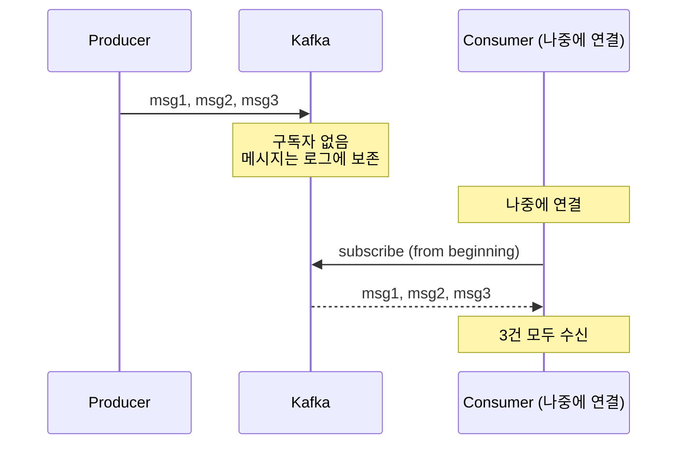
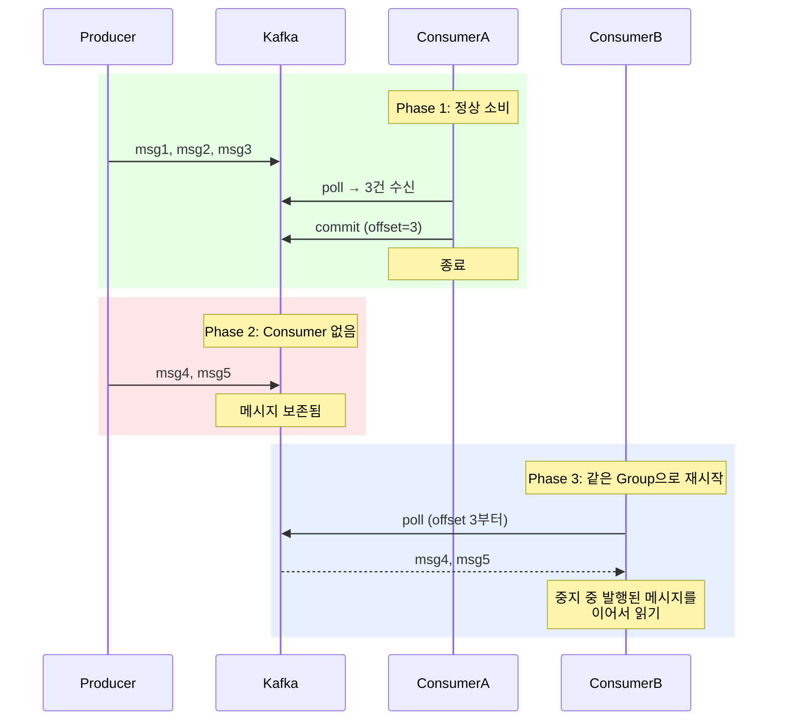
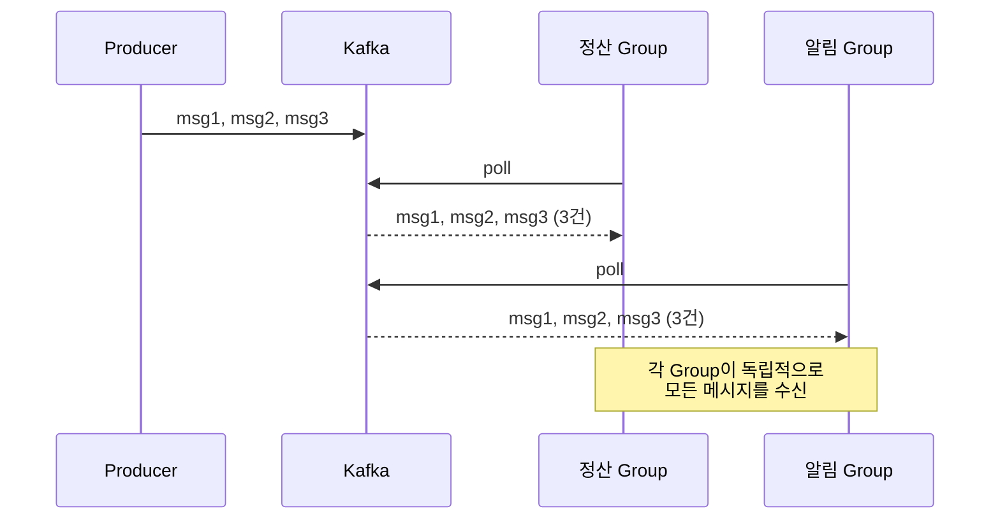
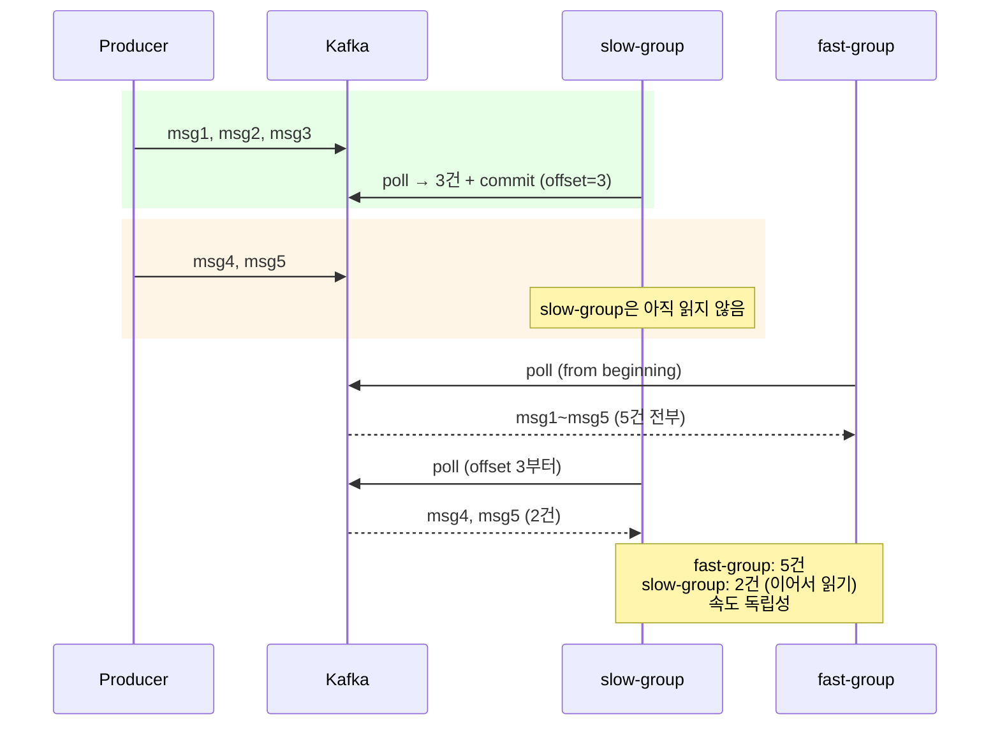
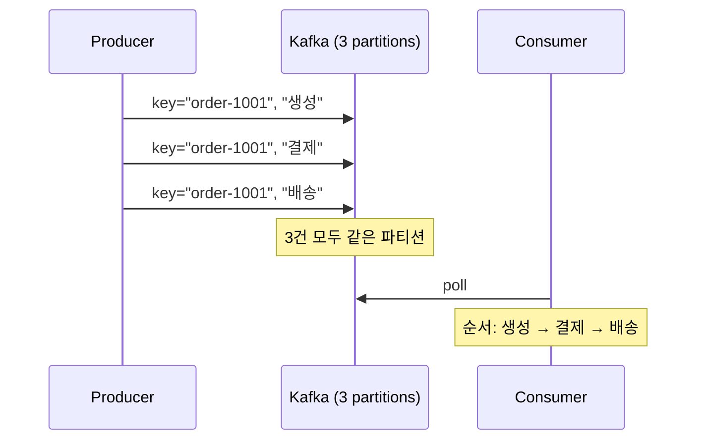
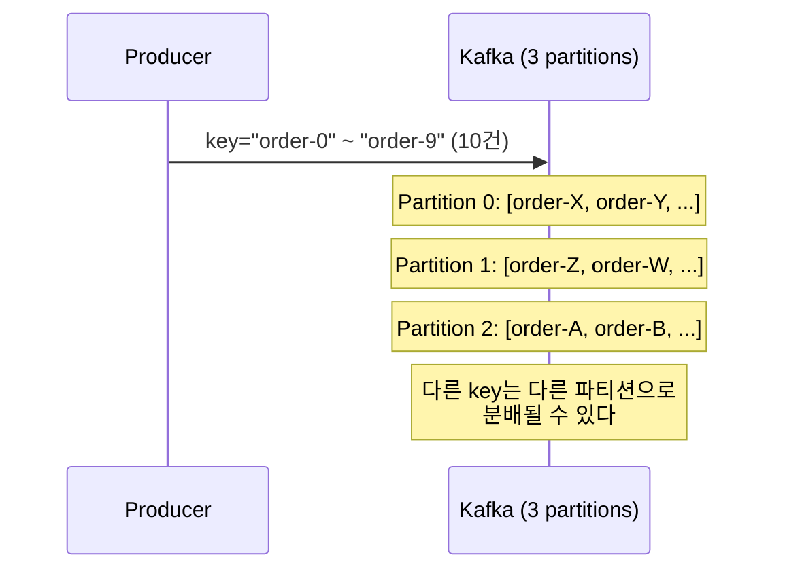
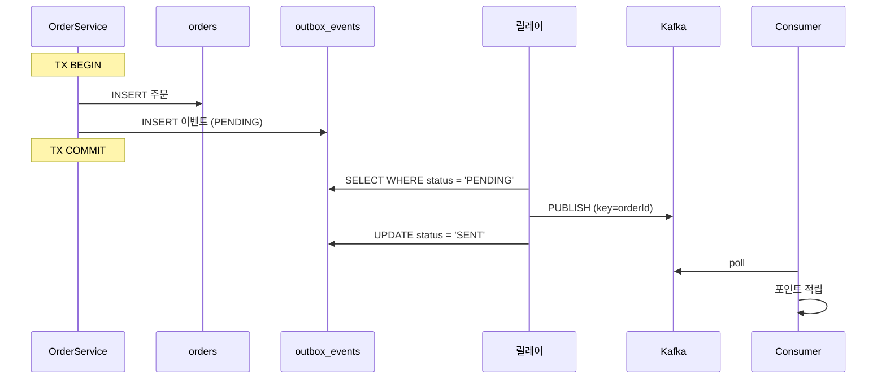
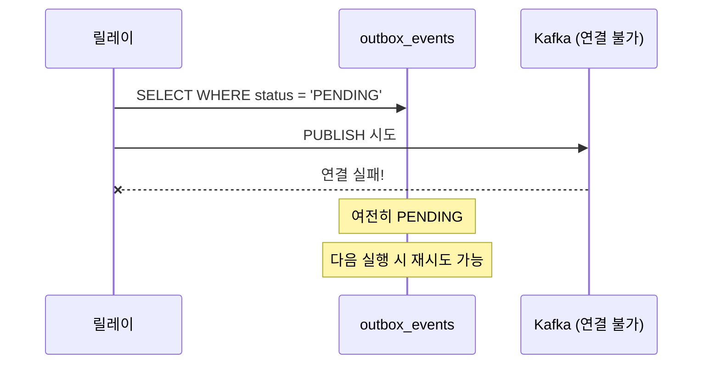
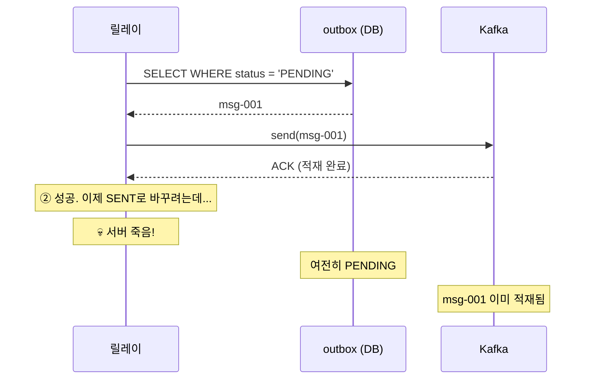
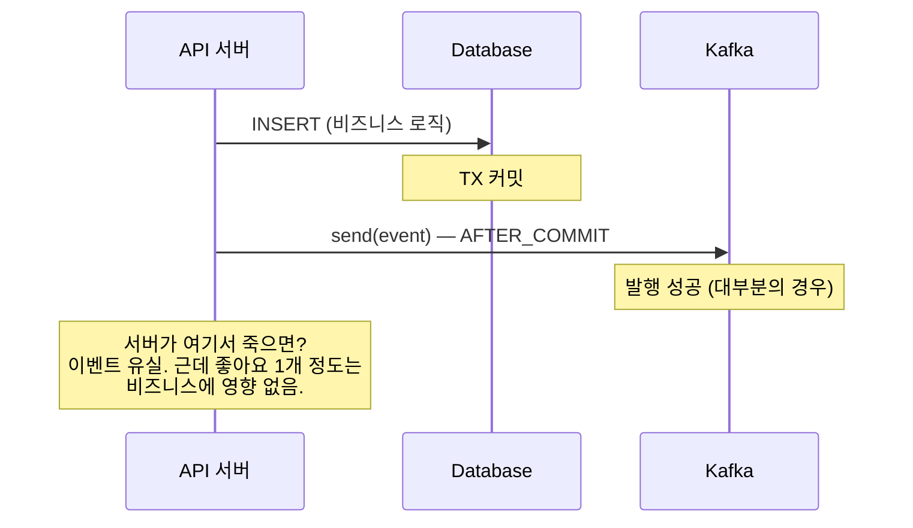

# Step 6 — Kafka

---

## Step 5의 한계에서 시작하자

Step 5에서 RabbitMQ로 "메시지를 저장한다"는 문제를 해결했다. Consumer가 없어도 큐에 남아있고, 다운 중에 발행된 메시지도 재시작 후 받을 수 있었다.

근데 한 가지 근본적인 특성이 남아있다. **Consumer가 ACK하면 메시지가 큐에서 삭제된다.**

```
"어제 포인트 적립 로직에 버그가 있었어.
 어제 주문 이벤트를 처음부터 다시 처리해야 해."

→ RabbitMQ: 불가능. 소비하면서 삭제했으니까.
```

그리고 Consumer Group이라는 개념이 없다. 정산 시스템, 알림 시스템, 분석 시스템이 같은 이벤트를 **각자 독립적으로** 소비하려면 Exchange + 큐 복제라는 복잡한 설정이 필요하다.

Kafka는 이 두 문제를 동시에 해결한다. 어떻게?

Kafka를 흔히 "메시지 큐"라고 부르지만, 본질은 **분산 로그 저장소(Distributed Log Store)**에 더 가깝다. Redis Pub/Sub은 "전달"이 목적이고, RabbitMQ는 "큐잉"이 목적이지만, **Kafka의 핵심은 "적재"다.** 메시지를 디스크에 로그로 쌓고, Consumer는 각자의 offset으로 읽어가는 구조다.

이 차이가 모든 것을 바꾼다.

---

## 소비해도 메시지가 사라지지 않는다

RabbitMQ와 가장 큰 차이부터 보자.

Kafka에서 Consumer가 없는 상태로 메시지를 발행하면?



> **KafkaMessagePreservationTest** — `구독자가_없어도_메시지는_Kafka에_보존된다()`에서 확인.

**Redis Pub/Sub이었다면 3건 전부 유실, RabbitMQ였다면 보존은 되지만 소비하면 삭제.** Kafka는 소비해도 로그에 남아있다. retention 기간(보통 7일) 동안 언제든 다시 읽을 수 있다.

Consumer가 중지됐다가 재시작하면?



> **KafkaMessagePreservationTest** — `Consumer가_중지된_사이에_발행된_메시지를_재시작_후_이어서_읽는다()`에서 확인.

**중지 중에 발행된 메시지를 이어서 읽는다.** Kafka는 각 Consumer Group의 offset을 기억하니까, "어디까지 읽었는가"를 추적할 수 있다. 배포 30초 동안 발생한 이벤트가 유실되는 일은 없다.

RabbitMQ도 "Consumer 다운 중 보존"은 되지만, 핵심 차이는 이거다. **RabbitMQ는 소비하면 삭제, Kafka는 소비해도 남아있다.** "어제 이벤트를 처음부터 다시 처리해야 해"가 Kafka에서는 offset을 되돌리는 것만으로 가능하다.

---

## 여러 시스템이 독립적으로 소비한다

정산 시스템, 알림 시스템, 분석 시스템이 같은 주문 이벤트를 각자 소비해야 한다. RabbitMQ에서는 Exchange + 큐 복제가 필요했다. Kafka에서는 **Consumer Group**으로 간단히 해결된다.



> **KafkaConsumerGroupIndependenceTest** — `두_Consumer_Group이_같은_토픽의_모든_메시지를_각각_독립적으로_수신한다()`에서 확인.

각 Group이 **자기만의 offset**을 관리하니까, 한 Group이 느려도 다른 Group에 영향이 없다.



> **KafkaConsumerGroupIndependenceTest** — `한_Consumer_Group의_소비_속도가_다른_Group에_영향을_주지_않는다()`에서 확인.

Redis Pub/Sub의 브로드캐스트와 비슷해 보이지만 결정적 차이가 있다. Redis는 메시지가 보존되지 않으니까 느린 Consumer가 놓치면 끝이다. RabbitMQ는 각 큐에 복제해야 하니까 설정이 복잡하다. Kafka는 하나의 로그를 여러 Group이 **각자의 속도로** 읽는 구조라서, 추가 설정 없이 독립적 소비가 된다.

---

## 순서가 보장되는 범위를 알아야 한다

Kafka에서 순서 보장은 **토픽 전체가 아니라 파티션 단위**다. 이 구분을 모르면 "순서가 보장된다고 했는데 왜 뒤집히지?"가 된다.

같은 key로 보내면 같은 파티션에 들어간다.



> **KafkaPartitionOrderingTest** — `같은_key의_메시지는_같은_파티션에_저장된다()`와 `같은_파티션의_메시지는_발행_순서대로_소비된다()`에서 확인.

다른 key는 다른 파티션으로 갈 수 있다. 그러면 서로 다른 주문 사이에는 순서가 보장되지 않는다.



> **KafkaPartitionOrderingTest** — `다른_key의_메시지는_다른_파티션으로_분배될_수_있다()`에서 확인.

그래서 **partition key 설계**가 중요하다. 같은 주문의 이벤트가 순서대로 처리돼야 하면 `orderId`를 key로 쓴다. 같은 상품의 이벤트가 순서대로 처리돼야 하면 `productId`를 key로 쓴다.

key 설계에서 흔히 틀리는 것: **공유 자원이 뭔지를 잘못 짚는 것이다.** 예를 들어 선착순 쿠폰 발급에서 key를 `userId`로 잡으면 같은 유저의 요청만 같은 파티션으로 간다. 근데 충돌이 나는 공유 자원은 "유저"가 아니라 "쿠폰 수량"이다. `couponId`를 key로 잡아야 같은 쿠폰에 대한 요청이 같은 파티션 → 같은 Consumer → 순차 처리가 된다. **동시성 문제를 락으로 막는 게 아니라, 설계로 발생 조건을 없애는 방식이다.**

단, partition key 하나에 트래픽이 극단적으로 몰리면 **Hot Partition**이 된다. 10만 명이 같은 쿠폰에 동시에 몰리면 해당 파티션 하나에 부하가 집중된다. 이 문제의 구체적인 해결 전략(Key Sharding, Redis 선착순 컷 등)은 kafka-lab에서 다룬다.

---

## 이제 Outbox를 완성하자

여기까지 Kafka의 기본 특성을 봤다. 이제 Step 3에서 만든 Event Store와 합칠 시간이다.

```
Step 3에서 한 것:
  도메인 저장 + 이벤트 기록 = 같은 TX (원자성)
  스케줄러가 PENDING 조회 → 같은 프로세스에서 처리 → PROCESSED

이 Step에서 바꾸는 것:
  스케줄러가 PENDING 조회 → Kafka로 발행 → SENT
  별도 Consumer가 Kafka에서 읽어서 처리
```

합치면 **Transactional Outbox Pattern**이다.



> **TransactionalOutboxCompletionTest** — `주문_저장과_이벤트_기록이_하나의_트랜잭션으로_묶인다()`에서 원자성을 확인.
> **TransactionalOutboxCompletionTest** — `릴레이가_PENDING_이벤트를_Kafka로_발행하고_SENT로_변경한다()`에서 릴레이를 확인.

### 왜 Kafka 발행을 트랜잭션 안에서 하지 않는가

DB와 Kafka는 서로 다른 시스템이다. **하나의 트랜잭션으로 원자성을 보장할 수 없다.** 어떤 순서로 하든 문제가 생긴다.

```
순서 1: TX 안에서 Kafka 먼저 발행 → DB 커밋
  Kafka 발행 성공 → DB 롤백
  → 원본 데이터는 없는데 이벤트가 Kafka에 전파됨

순서 2: TX 안에서 DB 커밋 → Kafka 발행
  DB 커밋 성공 → Kafka 발행 실패
  → 원본 데이터는 있는데 이벤트가 전파 안 됨
```

어느 쪽이든 정합성이 깨진다. 이건 Kafka만의 문제가 아니라 **트랜잭션 안에서 외부 I/O(Kafka, Redis, 외부 API)를 하면 안 되는** 근본적 이유다. 두 시스템 간에는 원자성이 없으니까.

그래서 DB에 먼저 기록하고(같은 TX), 실제 Kafka 발행은 별도 프로세스(릴레이)로 수행하는 것이다. 이게 Outbox Pattern의 핵심이다.

### Kafka 발행이 실패하면?

PENDING 상태가 유지된다. 다음 릴레이 실행 시 재시도할 수 있다.



> **TransactionalOutboxCompletionTest** — `Kafka_발행_실패_시_이벤트는_여전히_PENDING_상태를_유지한다()`에서 확인.

### 그런데 Kafka 발행이 성공한 뒤에 죽으면?

여기가 핵심이다. 릴레이가 Kafka에 발행하는 과정을 자세히 보자.

```
① PENDING 조회
② kafka.send() — 성공 (Kafka에 적재됨)
③ outbox status = SENT 로 변경 — 💀 여기서 서버가 죽으면?
```



Kafka에는 이미 들어갔는데, outbox에는 아직 PENDING이다. 릴레이가 재시작하면 PENDING을 다시 조회해서 **같은 메시지를 또 발행한다.** Kafka에 msg-001이 2건이 된다.

**"발행이 안 된 건 아니다. 발행됐다는 사실을 기록 못 한 것이다."**

그러면 순서를 바꿔서 SENT를 먼저 갱신하면?

```
① PENDING 조회
② outbox status = SENT 로 변경
③ kafka.send() — 💀 여기서 서버가 죽으면?
→ SENT인데 Kafka에는 안 들어감 → 메시지 유실
```

**중복보다 유실이 훨씬 위험하다.** 중복은 Consumer 멱등으로 막을 수 있지만, 유실은 복구할 방법이 없다. 그래서 **"발행 먼저, 상태 갱신 나중에"** 순서를 선택한다.

이게 **At Least Once 발행 보장**이다. 0번 전달은 절대 없고, 2번은 있을 수 있다. 그리고 그 "2번"을 Step 7의 멱등 처리가 막아준다. 합치면 **effectively exactly-once**가 된다.

### 자주 혼동되는 것 — Idempotent Producer와 Outbox는 다른 문제를 해결한다

```
Kafka Idempotent Producer (enable.idempotence=true):
  Producer가 리트라이하다가 같은 메시지가 브로커에 2번 들어가는 걸 막는다.
  → 브로커 내부의 안전 장치.

Outbox Pattern:
  애플리케이션이 DB는 커밋했는데 Kafka 발행 자체를 못 한 경우를 막는다.
  → 애플리케이션 레벨의 안전 장치.
```

Idempotent Producer를 켜도 "발행 자체가 안 된" 상황은 커버 못 한다. Outbox가 "반드시 발행한다"를 보장하고, Idempotent Producer가 "브로커 안에서 중복을 막는다"를 보장한다. **둘은 보장 범위가 다른 보완재다.**

---

## 모든 이벤트에 Outbox를 써야 하는가? — 아니다

Outbox를 완성했다. 그러면 모든 이벤트에 다 적용해야 하는가?

**아니다.** Outbox 패턴을 도입하면 운영 복잡도가 생긴다.

```
1. DB 의존 증가
   이벤트 발행을 위해 메시지 브로커를 도입했는데,
   Outbox로 인해 이벤트 발행마저 DB에 의존하는 구조가 된다.

2. 쓰기 부하 증가
   비즈니스 로직 쓰기 + Outbox 쓰기가 같은 트랜잭션에서 발생한다.
   트랜잭션이 길어지고 DB 커넥션 점유 시간이 늘어난다.

3. 릴레이 프로세스 관리
   Outbox를 폴링해서 Kafka로 릴레이하는 별도 프로세스를 운영해야 한다.
   이 프로세스가 죽으면 발행이 밀린다.
```

이 복잡도를 **모든 이벤트에 적용하는 건 과도한 엔지니어링**이다.

### 판단 기준 — 복구 가능성과 복구 비용으로 결정한다

두 가지 질문을 던진다.

```
(1) 이 이벤트가 유실되었을 때, 시스템적으로 복구 가능한가?
(2) 복구 가능하다면, 복구 비용이 얼마나 되는가?

답에 따라:
  복구 불가능 — 결제 이벤트가 유실되면 돈이 안 맞는데, 이걸 자동으로 복구할 수단이 없다.
  → Outbox 필수. 원자성 비용을 감수한다.

  복구 가능하지만 비용이 높음 — 재고 차감 이벤트가 유실되면 초과 판매가 나는데,
  수작업으로 대조해야 한다.
  → Outbox 권장.

  복구 가능하고 비용이 낮음 — 좋아요 집계가 유실되면 수치가 1개 틀리는데,
  배치로 정합성을 맞추면 그만이다.
  → 직접 발행으로 충분하다.
```

| 이벤트 유형 | 복구 가능성 | 복구 비용 | 전략 | 이유 |
|-----------|-----------|----------|------|------|
| 결제 완료, 주문 생성, 정산 | 불가능 | — | Outbox 필수 | 대체 복구 수단 없음. 유실 = 즉시 사업 손실 |
| 재고 차감, 쿠폰 발급 | 가능 (수동 대조) | 높음 | Outbox 권장 | 자동 복구 어렵고, 유실 인지도 느림 |
| 좋아요, 조회수, 추천 집계 | 가능 (배치 재집계) | 낮음 | 직접 발행 | 배치로 정합성 맞추면 됨 |
| 로그 수집, 분석 이벤트 | 가능 (재수집) | 매우 낮음 | 직접 발행 (acks=0도 가능) | 유실보다 처리량이 중요 |

> 하나 더 — **이 이벤트가 외부 시스템의 유일한 트리거인가?** 외부 시스템이 이 이벤트를 기반으로 동작을 시작하는 구조라면, 유실 = 전체 흐름이 멈추는 것이다. 이 경우 복구 가능 여부와 무관하게 Outbox를 적용한다. 예: 좋아요/조회수가 "분석 집계용"이 아니라 "API 응답의 유일한 소스"라면 복구 비용이 올라간다. 별도 실시간 카운터가 있는지 여부로 판단이 달라진다.

### Outbox 없이 직접 발행하는 구조

복구 비용이 낮은 이벤트는 `@TransactionalEventListener(AFTER_COMMIT)` + 직접 Kafka 발행으로 충분하다.



Step 2에서 봤듯이 AFTER_COMMIT은 메모리 기반이라 프로세스가 죽으면 유실된다. **근데 유실돼도 괜찮은 이벤트라면 이 구조로 충분하다.** Outbox의 복잡도를 감수할 이유가 없다.

### 과도한 엔지니어링의 위험

```
"좋아요 이벤트에 Outbox를 적용했다"

→ 좋아요 1회마다 DB에 2건 쓰기 (비즈니스 + Outbox)
→ 릴레이 프로세스가 초당 수만 건의 좋아요 Outbox를 폴링
→ Outbox 테이블에 수억 건 적재 → 파티셔닝/삭제 스크립트 필요
→ 이 모든 복잡도가 "좋아요 1개 유실 방지"를 위한 것

비용 > 이득. 이건 좋은 설계가 아니다.
```

단, 이건 규모에 따라 달라진다. 좋아요가 초당 수만 건이면 위의 복잡도가 실제 문제가 되고, Outbox 선별 적용이 맞다. 초당 수십~수백 건이면 "패턴 2개를 유지하는 인지 비용"이 "Outbox INSERT 비용"보다 클 수 있다. 그때는 전부 Outbox로 통일하는 것도 합리적이다. 핵심은 "Outbox를 쓸까 말까"가 아니라 **"복구 가능성과 복구 비용 vs 원자성 비용"을 따지는 것**이다. Outbox는 원자성 비용을 내고 유실 리스크를 줄이는 선택지이므로, 이벤트의 중요도에 맞게 선별 적용하는 게 합리적이다.

> **Outbox는 "유실되면 돈이 안 맞는 이벤트"에 쓰는 것이다.** 모든 이벤트에 적용하는 건 과도한 엔지니어링이다. 복잡도에는 반드시 이유가 있어야 한다.

### Outbox 릴레이의 운영 한계

Outbox 릴레이(스케줄러)는 PENDING을 주기적으로 폴링해서 Kafka에 발행한다. 이 구조에는 두 가지 한계가 있다.

**분산 한계:** API 서버가 2대로 늘면 스케줄러도 2개가 돈다. 같은 PENDING을 동시에 잡아서 중복 발행한다. 릴레이는 API 서버와 분리해서 단일 인스턴스로 운영하는 게 기본이다. API는 스케일 아웃, 릴레이는 단일 인스턴스 — 이렇게 분리해야 API 확장이 릴레이에 의해 제약받지 않는다.

**규모 한계:** 피크 타임에 PENDING이 수만 건 쌓이면 폴링 주기 안에 처리를 못 한다. 다음 주기가 돌아오면서 이전 건과 중복 처리가 쌓이고, 더 큰 장애가 된다.

규모가 커지면 릴레이 방식을 진화시킨다.

| 단계 | 방식 | 적합한 규모 |
|------|------|-----------|
| 1 | 단일 인스턴스 폴링 | 소규모 (수백 TPS 이하) |
| 2 | 분산 락(ShedLock 등) + 다중 인스턴스 폴링 | 중규모 |
| 3 | CDC (Debezium 등, binlog 기반) | 대규모 — 폴링 자체를 없앤다 |

이 lab에서는 단계 1만 다룬다. CDC는 별도 주제다.

---

## 여기까지 온 길을 돌아보면

```
Step 1: ApplicationEvent로 분리 → 같은 TX라서 리스너 실패 시 롤백
Step 2: AFTER_COMMIT + @Async → 안전하지만 메모리 휘발
Step 3: Event Store → DB에 기록해서 유실 방지, 근데 같은 프로세스
Step 4: Redis Pub/Sub → 프로세스 밖 전달, 근데 메시지 비보존
Step 5: RabbitMQ → 큐에 저장, 근데 소비하면 삭제 (재처리 불가)
Step 6: Kafka → 소비해도 로그에 남음 + 재처리 가능
        + Step 3 Event Store 합치면 = Transactional Outbox Pattern
```

각 Step이 이전 Step의 한계를 해결하면서 여기까지 왔다. **Kafka가 갑자기 등장한 게 아니라, Redis → RabbitMQ → Kafka로 한 단계씩 한계를 넘으면서 자연스럽게 도달한 것이다.**

---

## 스스로 답해보자

- RabbitMQ에서 ACK하면 메시지가 삭제되는데, Kafka에서는 왜 남아있는가?
- Consumer Group A가 느려도 Group B에 영향이 없는 이유는?
- "순서 보장"이 토픽 전체가 아니라 파티션 단위인 이유는?
- 선착순 쿠폰 발급에서 key를 `userId`가 아니라 `couponId`로 잡아야 하는 이유는?
- Outbox Pattern에서 Kafka 발행을 왜 트랜잭션 안에서 하지 않는가? (양쪽 시나리오를 말할 수 있는가?)
- "발행 먼저, 상태 갱신 나중에" 순서를 선택한 이유는?
- Idempotent Producer와 Outbox Pattern이 해결하는 문제가 어떻게 다른가?
- At Least Once 발행이 보장되면, Consumer 쪽에서는 어떤 문제가 생기는가?
- 좋아요 이벤트에 Outbox를 적용해야 하는가? 판단 기준은 무엇인가?
- Outbox 릴레이를 API 서버와 분리해야 하는 이유는?

> 마지막 질문의 답이 Step 7의 존재 이유다.
> 답이 바로 나오면 Step 7로 넘어가자.

---

## 참고

| 주제 | 링크 |
|------|------|
| Kafka 공식 문서 | [Apache Kafka Documentation](https://kafka.apache.org/documentation/) |
| Transactional Outbox Pattern | [Microservices.io — Transactional Outbox](https://microservices.io/patterns/data/transactional-outbox.html) |
| 쿠팡 마이크로서비스 전환 (비타민 MQ) | [마이크로서비스 아키텍처로의 전환 — 쿠팡 엔지니어링](https://medium.com/coupang-engineering/how-coupang-built-a-microservice-architecture-fd584fff7f2b) |
| 배민 포인트 시스템 (SQS 비동기) | [신규 포인트 시스템 전환기 #1 — 우아한형제들 기술블로그](https://woowabros.github.io/experience/2018/10/12/new_point_story_1.html) |

---

## 다음 Step으로

At Least Once 발행을 보장하면, **같은 메시지가 2번 올 수 있다.**

릴레이 쪽: kafka.send() 성공 → SENT 갱신 전에 죽음 → 재시작 시 다시 발행 → **중복 발행.**
Consumer 쪽: 메시지 처리 성공 → offset 커밋 전에 죽음 → 재시작 시 다시 읽음 → **중복 소비.**

**같은 구조의 문제다.** "작업 + 상태 갱신 사이의 간극"이 Producer에서는 "send + SENT", Consumer에서는 "처리 + offset 커밋"으로 나타난다. 어느 쪽이든 **포인트가 2번 적립되거나, 쿠폰이 2번 발급된다.**

Step 7에서 이 중복을 방어하는 멱등 패턴을 구현한다.