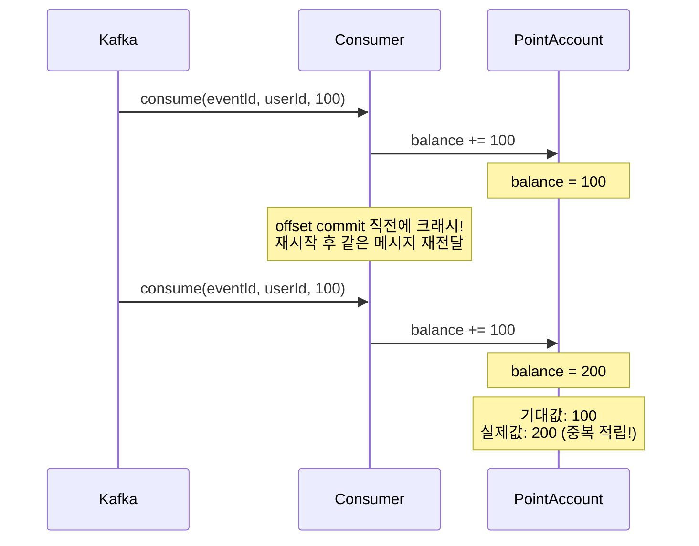
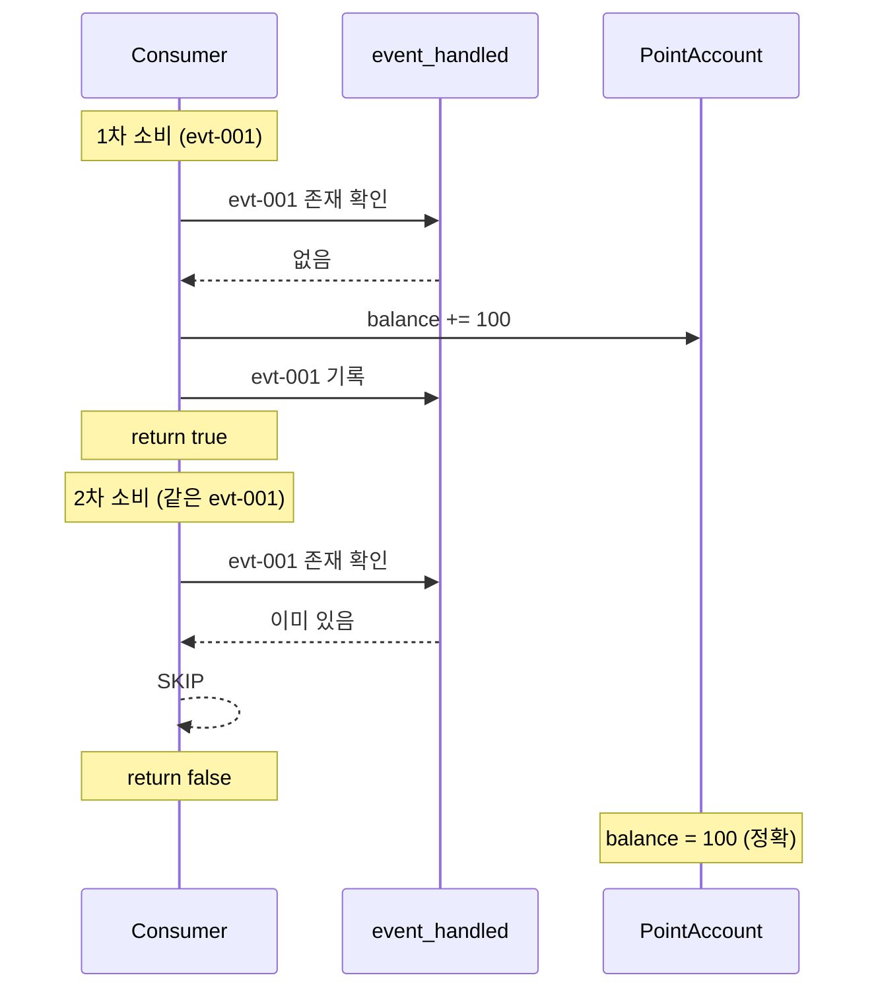
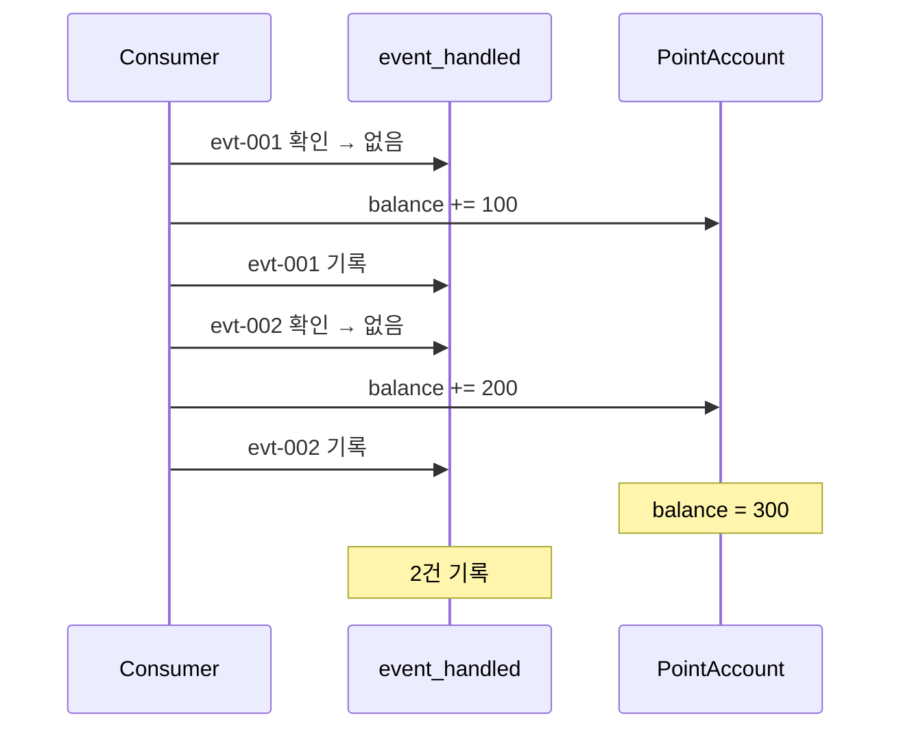
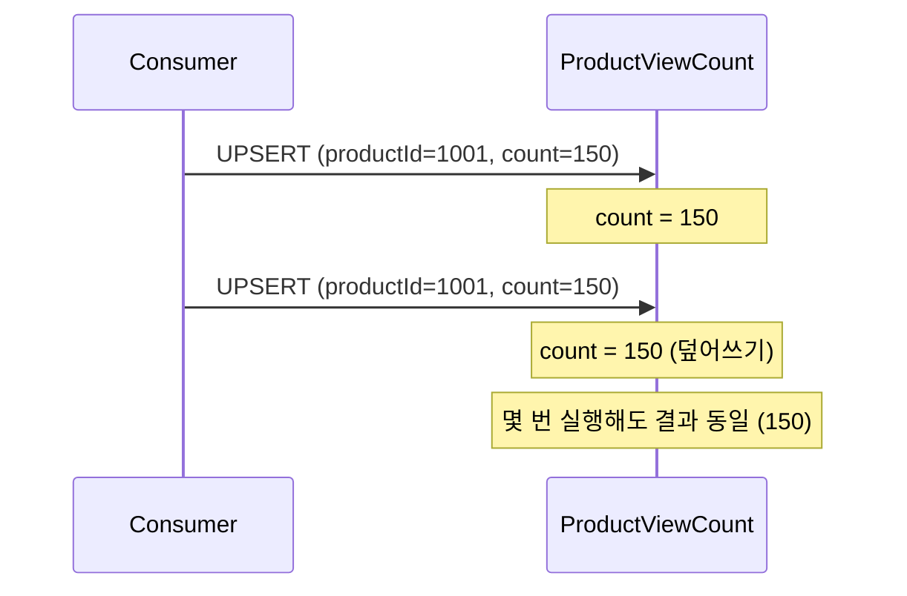
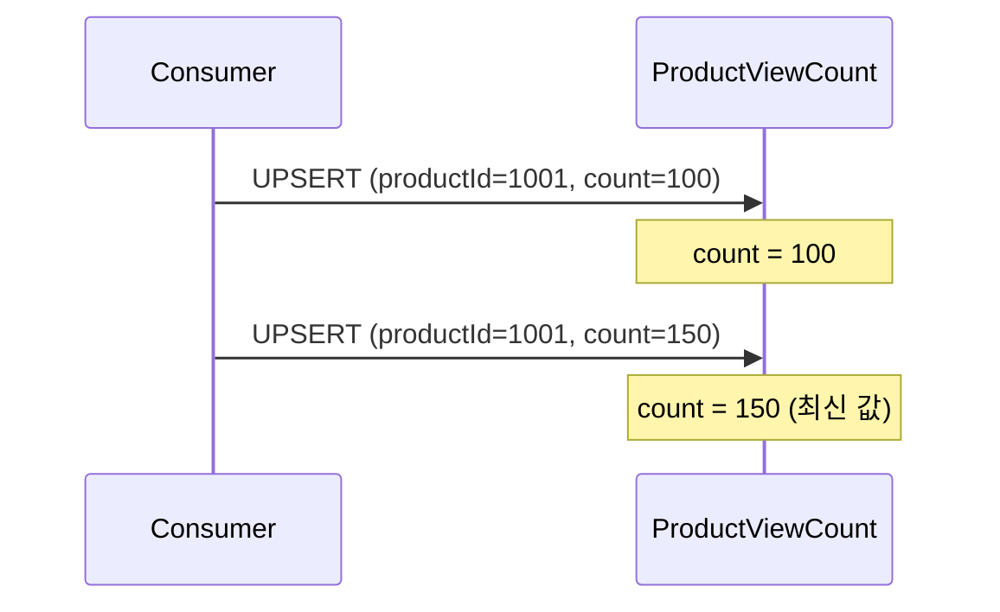
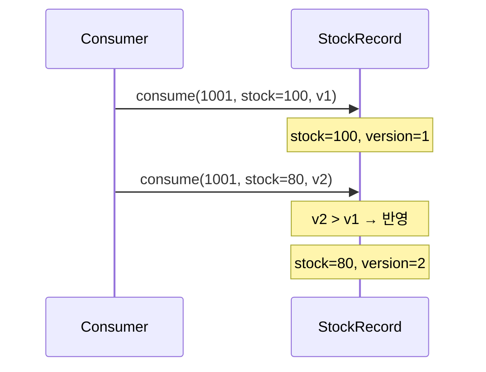
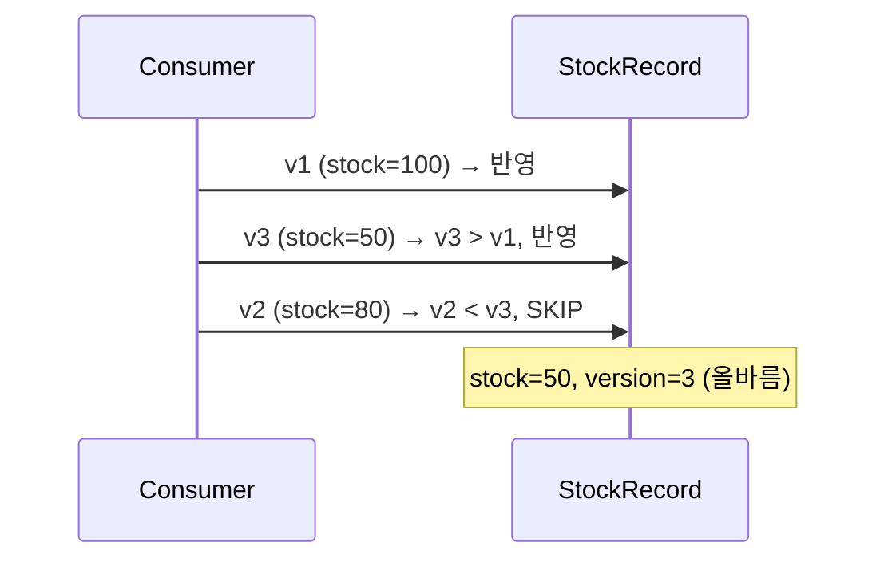
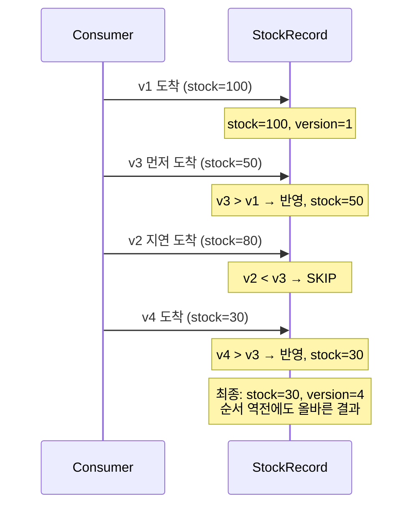
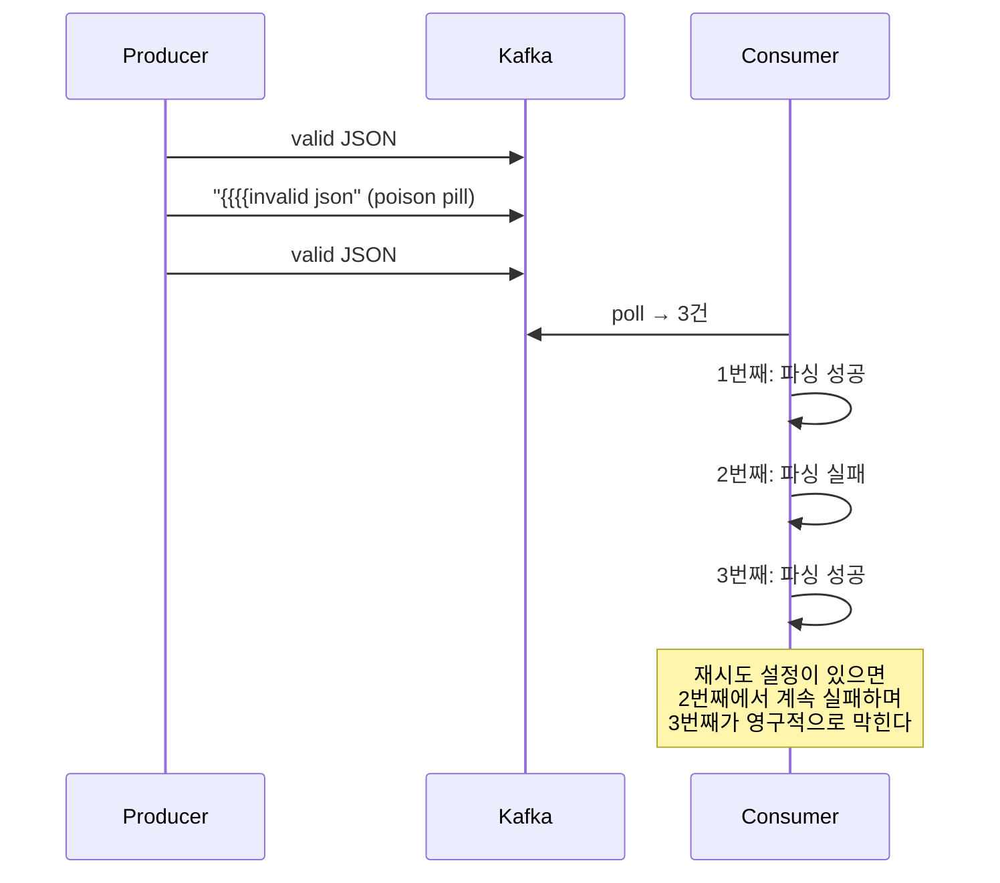
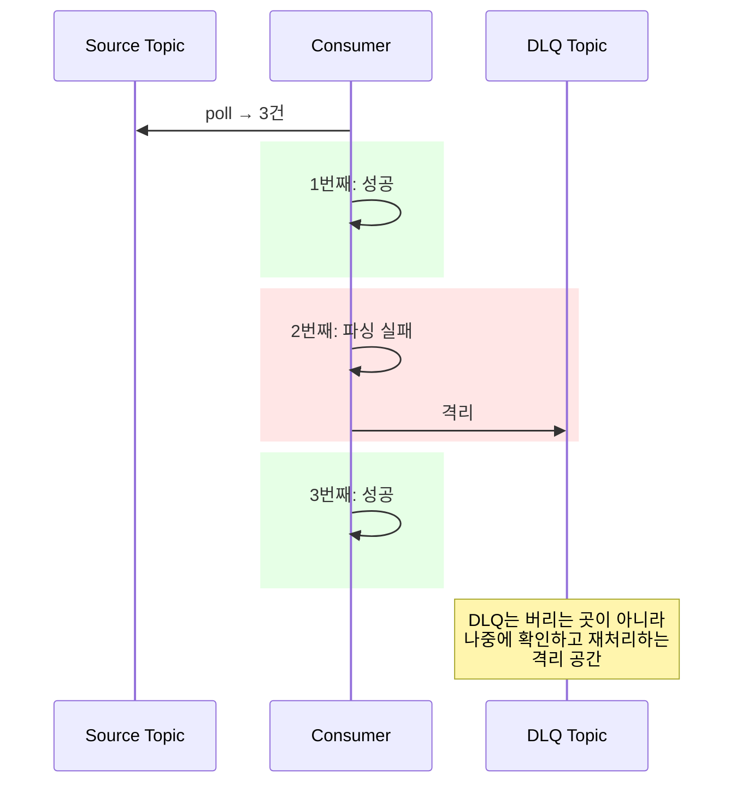

# Step 7 — Idempotent Consumer

---

## Step 6의 한계에서 시작하자

Step 6에서 Transactional Outbox Pattern을 완성했다. 릴레이가 PENDING 이벤트를 Kafka로 발행하고, 실패하면 PENDING을 유지해서 재시도한다. **At Least Once** — 한 번은 반드시 도달한다.

"At Least Once"라는 말을 뒤집어 보자. **"최소 한 번"이면 "두 번 이상"도 가능하다는 뜻이다.**

어떤 상황에서 두 번이 되는가?

```
시나리오 1: 릴레이가 Kafka에 발행 → SENT로 바꾸기 직전에 서버 죽음
  → 재시작 시 같은 이벤트를 다시 발행 (PENDING이니까)
  → Kafka에 같은 메시지가 2건

시나리오 2: Consumer가 메시지를 처리 → offset 커밋 직전에 죽음
  → 재시작 시 같은 메시지를 다시 읽음 (offset이 안 넘어갔으니까)
  → 같은 메시지를 2번 처리
```

이게 실제로 어떤 일을 만드는지 보자.

---

## 같은 메시지가 2번 오면 어떻게 되는가

포인트 적립 Consumer가 같은 `OrderCreatedEvent`를 2번 받으면?



> **DuplicateConsumptionProblemTest** — `같은_메시지를_2번_소비하면_포인트가_2번_적립된다()`에서 확인.

**100원 적립돼야 하는데 200원이 적립됐다.** 이게 At Least Once의 대가다.

그러면 어떻게 막는가? 세 가지 패턴이 있고, 각각 적합한 상황이 다르다.

---

## 패턴 1: event_handled — "이 이벤트를 이미 처리했는가?"

가장 범용적인 방법. 별도 테이블에 처리 기록을 남기고, 같은 eventId가 오면 건너뛴다.



> **EventHandledIdempotencyTest** — `event_handled_테이블에_이미_처리된_이벤트가_있으면_스킵한다()`에서 확인.

서로 다른 eventId의 메시지는 당연히 각각 정상 처리된다.



> **EventHandledIdempotencyTest** — `서로_다른_event_id의_메시지는_각각_정상_처리된다()`에서 확인.

여기서 중요한 점 하나. **"처리 기록"과 "비즈니스 로직"이 같은 트랜잭션이어야 한다.** 포인트를 적립하고 event_handled에 기록하기 전에 죽으면, 재시작 시 또 적립한다. 둘을 같은 TX로 묶어야 "적립 + 기록"이 원자적으로 동작한다.

**장점:** 어떤 도메인이든 적용 가능. eventId만 있으면 된다.
**비용:** 별도 테이블 필요. 매 메시지마다 조회 1회 추가. 테이블이 커지면 관리 필요 (TTL, 파티셔닝).

---

## 패턴 2: Upsert — "있으면 덮어쓰고, 없으면 삽입한다"

집계성 데이터(조회수, 좋아요수, 판매량)에 적합한 방법.



> **UpsertIdempotencyTest** — `같은_이벤트를_2번_처리해도_upsert로_올바른_결과가_유지된다()`에서 확인.

최신 값으로 덮어쓰니까 최종 상태가 항상 보장된다.



> **UpsertIdempotencyTest** — `upsert는_최신_값으로_덮어쓰므로_최종_상태가_보장된다()`에서 확인.

다른 상품의 이벤트는 각각 독립적으로 집계된다.

> **UpsertIdempotencyTest** — `다른_상품의_이벤트는_각각_독립적으로_upsert된다()`에서 확인.

여기서 한 가지 짚고 넘어가야 할 것이 있다. 조회수를 `+1`하는 upsert에서 같은 이벤트가 2번 오면 `+2`가 되지 않나? 맞다. **"최신 값으로 덮어쓰는" upsert는 멱등이지만, "+1 증분" upsert는 엄밀히 멱등이 아니다.** 조회수처럼 약간의 오차가 허용되는 집계에서 쓰는 패턴이다. 정확한 멱등이 필요하면 패턴 1(event_handled)이나 패턴 3(version)을 써야 한다.

**장점:** 별도 테이블 없음. 한 문장으로 끝남.
**비용:** 도메인 특성에 의존. "덮어쓰기"가 의미 있는 데이터에만 적합.

---

## 패턴 3: version 비교 — "현재보다 새로운 이벤트만 반영한다"

중복 방어를 넘어서 **순서 역전까지 방어**해야 할 때 쓰는 방법.

왜 순서 역전이 생기는가? 파티션이 다르거나, 재발행이 일어나면 발행 순서와 소비 순서가 달라질 수 있다.

```
발행 순서: v1(1000원) → v2(2000원) → v3(1500원)
소비 순서: v1(1000원) → v3(1500원) → v2(2000원)  ← 역전!

version 비교 없이: 최종 가격 = 2000원 (잘못됨, 1500원이어야 함)
version 비교 있음: v2는 v3보다 낮으므로 무시 → 최종 가격 = 1500원 (정확)
```



> **VersionComparisonIdempotencyTest** — `version이_현재보다_높은_이벤트만_반영된다()`에서 확인.

현재보다 낮거나 같은 version은 무시한다.



> **VersionComparisonIdempotencyTest** — `version이_현재보다_낮거나_같은_이벤트는_무시된다()`에서 확인.

순서가 뒤섞여서 v1 → v3 → v2 → v4로 도착해도, 최종 상태는 올바르다.



> **VersionComparisonIdempotencyTest** — `순서가_역전된_이벤트_시퀀스에서_최종_상태가_올바르다()`에서 확인.

**장점:** 중복 방어 + 순서 역전 방어를 동시에 해결.
**비용:** 이벤트에 version 필드가 필요. 구현 복잡도 높음.

---

## 세 패턴을 언제 쓰는가

| 패턴 | 적합한 상황 | 핵심 메커니즘 | 비용 |
|------|-----------|------------|------|
| event_handled | 범용. 어떤 도메인이든 | eventId PK로 중복 차단 | 별도 테이블, 매번 조회 |
| Upsert | 집계성 데이터 (조회수, 좋아요수) | INSERT ON DUPLICATE KEY UPDATE | 도메인 의존적 |
| version 비교 | 순서 역전까지 방어 | UPDATE WHERE version < newVersion | 구현 복잡 |

"모든 Consumer에 멱등을 걸어야 하는가?"

**아니다.** Step 0에서 세운 판단 기준이 여기서도 쓰인다.

```
반드시 멱등이 필요한 곳:
  포인트 적립 — 중복되면 돈 문제
  결제 처리 — 이중 결제
  재고 차감 — 이중 차감
  → "중복되면 비즈니스에 영향이 있는가?" → Yes

멱등 없이도 괜찮을 수 있는 곳:
  알림 발송 — 같은 알림 2번. 불편하지만 치명적이지 않음
  로그 적재 — 로그가 2줄. 분석에 약간의 오차
  → "중복되면 비즈니스에 영향이 있는가?" → No
```

멱등 저장소로 DB와 Redis 중 어디를 쓸 것인가? **DB가 더 안전하다.** Redis는 휘발성과 원자성 문제가 있어서, 멱등성 보장 저장소로는 불리하다. Redis는 앞단 트래픽 제어나 초고속 컷오프 용도에 더 가깝다.

---

## 처리 불가능한 메시지는 격리해야 한다

멱등 처리는 "같은 메시지가 2번 오는" 문제를 해결한다. 근데 **"처리 자체가 불가능한 메시지"**는 다른 문제다.

파싱이 안 되는 JSON, 스키마가 바뀐 이벤트, 필수 필드가 없는 메시지. 이런 **poison pill**은 몇 번을 재시도해도 실패한다. 그리고 이 메시지가 Consumer를 막으면 뒤에 있는 정상 메시지도 처리 못 한다.



> **PoisonPillAndDlqTest** — `파싱_불가능한_메시지가_Consumer를_막는다()`에서 확인.

해결 방법이 **DLQ(Dead Letter Queue)**다. 처리 실패한 메시지를 별도 토픽으로 격리한다.



> **PoisonPillAndDlqTest** — `처리_실패한_메시지를_DLQ_토픽으로_격리할_수_있다()`에서 확인.

DLQ에 격리된 메시지는 나중에 운영자가 확인하고, 원인을 파악해서 수정하거나 재처리하거나 폐기한다. DLQ를 설정했다고 끝이 아니라, **"DLQ에 쌓인 걸 누가 보는가"**까지 운영 구조를 갖춰야 한다. 아무도 안 보면 유실이랑 다를 게 없다.

---

## 여기까지 온 전체 여정

```
Step 0: Command vs Event — "뭘 분리할 수 있는가?"
Step 1: ApplicationEvent — "이벤트로 끊자" → 같은 TX라서 롤백 전파
Step 2: Transactional Event — "커밋 후에 실행" → 메모리 휘발 + 함정들
Step 3: Event Store — "DB에 기록" → 같은 프로세스 한계
Step 4: Redis Pub/Sub — "프로세스 밖으로" → 메시지 비보존
Step 5: RabbitMQ — "큐에 저장" → 소비하면 삭제
Step 6: Kafka — "소비해도 보존" + Outbox 완성 → 중복 소비
Step 7: Idempotent Consumer — "중복이 와도 한 번만 처리" + 실패 격리
```

각 Step이 이전 Step의 한계를 해결했다. **메시징의 진화는 "갑자기 Kafka를 써야 해"가 아니라, 한계를 하나씩 넘은 결과다.**

그리고 이 전체를 관통하는 최종 공식은 이거다.

```
발행은 At Least Once → 한 번은 반드시 도달한다
소비는 멱등하게     → 중복이 와도 결과는 같다
실패는 격리        → 처리 못 하는 메시지가 정상 흐름을 막지 않는다
```

이 공식은 Kafka든 RabbitMQ든 SQS든, 메시지 기반 시스템이면 동일하게 적용된다.

---

## 스스로 답해보자

- At Least Once에서 왜 중복이 생기는가? 구체적인 시나리오 2개를 말할 수 있는가?
- event_handled 패턴에서 "처리 기록"과 "비즈니스 로직"이 같은 트랜잭션이어야 하는 이유는?
- Upsert에서 "덮어쓰기"와 "+1 증분"의 멱등성 차이는?
- version 비교가 순서 역전을 방어하는 원리는?
- "모든 Consumer에 멱등을 걸어야 하는가?"에 대한 판단 기준은?
- 멱등성 저장소로 Redis보다 DB가 안전한 이유는?
- Poison pill이 왜 위험하고, DLQ를 설정했다고 끝이 아닌 이유는?

> 전부 답이 나오면 messaging-lab을 완주한 것이다.

---

## 참고

| 주제 | 링크 |
|------|------|
| 배민 포인트 시스템 (SQS 순서 역전 + DLQ) | [신규 포인트 시스템 전환기 #1 — 우아한형제들 기술블로그](https://woowabros.github.io/experience/2018/10/12/new_point_story_1.html) |
| Transactional Outbox + Idempotent Consumer | [Microservices.io — Transactional Outbox](https://microservices.io/patterns/data/transactional-outbox.html) |
| Kafka Consumer Semantics | [Apache Kafka Documentation — Consumer](https://kafka.apache.org/documentation/#consumerconfigs) |