# Step 7 — Idempotent Consumer

---

## Step 6의 한계에서 시작하자

Step 6에서 Transactional Outbox Pattern을 완성했다. 릴레이가 PENDING 이벤트를 Kafka로 발행하고, 실패하면 PENDING을 유지해서 재시도한다. **At Least Once** — 한 번은 반드시 도달한다.

"At Least Once"라는 말을 뒤집어 보자. **"최소 한 번"이면 "두 번 이상"도 가능하다는 뜻이다.**

어떤 상황에서 두 번이 되는가?

```
시나리오 1: 릴레이가 Kafka에 발행 → SENT로 바꾸기 직전에 서버 죽음
  → 재시작 시 같은 이벤트를 다시 발행 (PENDING이니까)
  → Kafka에 같은 메시지가 2건

시나리오 2: Consumer가 메시지를 처리 → offset 커밋 직전에 죽음
  → 재시작 시 같은 메시지를 다시 읽음 (offset이 안 넘어갔으니까)
  → 같은 메시지를 2번 처리
```

이게 실제로 어떤 일을 만드는지 보자.

---

## 같은 메시지가 2번 오면 어떻게 되는가

포인트 적립 Consumer가 같은 `OrderCreatedEvent`를 2번 받으면?

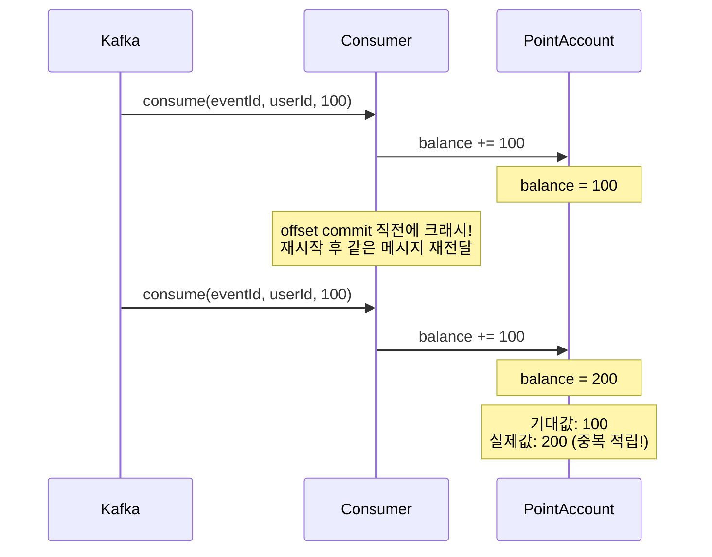

> **DuplicateConsumptionProblemTest** — `같은_메시지를_2번_소비하면_포인트가_2번_적립된다()`에서 확인.

**100원 적립돼야 하는데 200원이 적립됐다.** 이게 At Least Once의 대가다.

그러면 어떻게 막는가? 멱등 처리를 추가하기 전에 먼저 확인할 것이 있다. **"우리 도메인이 이미 자연스럽게 멱등한가?"**

---

## 먼저 확인 — 도메인 상태가 이미 멱등을 보장하는가?

별도 테이블도 version 필드도 필요 없이, **도메인 상태 자체가 멱등을 보장하는** 경우가 있다. 상태 전이가 단방향(전진만 가능)인 도메인이다.

```java
// 주문 상태: CREATED → PAID → SHIPPED → DELIVERED
void handlePaymentCompleted(String orderId) {
    Order order = orderRepository.findById(orderId);
    if (order.getStatus() != OrderStatus.CREATED) {
        return; // 이미 PAID 이상이면 무시
    }
    order.markPaid();
}
```

같은 "결제 완료" 이벤트가 2번 와도, 첫 번째에서 PAID로 바뀌었으면 두 번째는 조건에 안 걸려서 무시된다. **도메인 로직 자체가 멱등이다.**

단, **상태가 단방향(전진만 가능)일 때만 동작한다.** `CREATED → PAID → SHIPPED`는 되지만, `PAID ↔ REFUNDED`처럼 양방향 전이가 가능한 도메인에서는 안 된다. 환불 이벤트가 2번 오면 2번 다 통과할 수 있다.

이걸 확인하는 게 멱등 처리의 **첫 번째 판단**이다. 도메인 상태가 이미 멱등하면 아래 패턴을 추가할 필요가 없다. 불필요한 비용이다.

```
판단 순서:
  1. 도메인 상태가 단방향 전이로 이미 멱등한가? → Yes면 추가 장치 불필요
  2. 아니면 → event_handled / upsert / version 중 선택
```

**장점:** 비용이 가장 낮다. 별도 테이블도 version도 필요 없다.
**한계:** 상태 전이가 단방향인 도메인에서만. 카운터(+1), 포인트 적립처럼 누적하는 연산에는 적용 불가.

아래 세 패턴은 도메인 상태만으로 멱등이 보장되지 않을 때 **추가하는** 장치다.

---

## 패턴 1: event_handled — "이 이벤트를 이미 처리했는가?"

가장 범용적인 방법. 별도 테이블에 처리 기록을 남기고, 같은 eventId가 오면 건너뛴다.

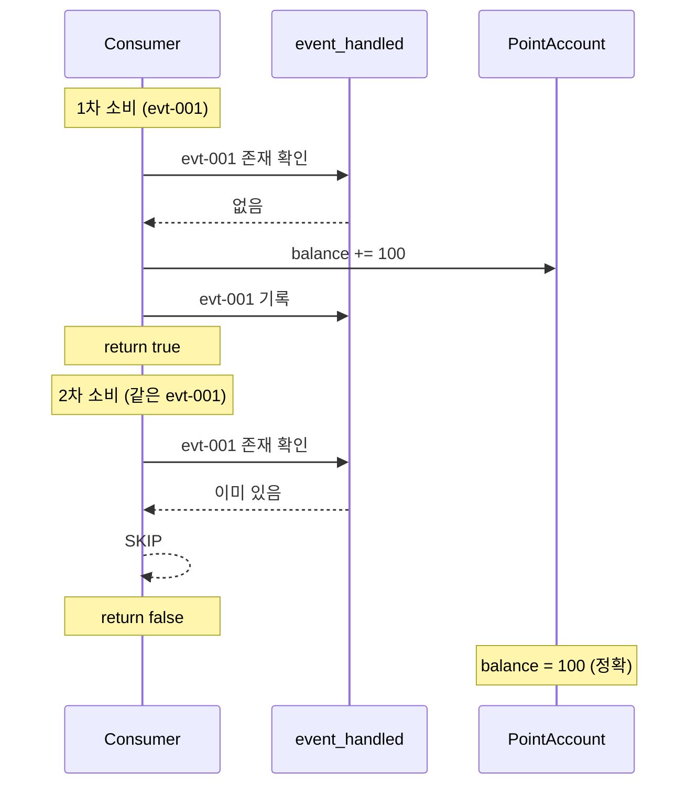

> **EventHandledIdempotencyTest** — `event_handled_테이블에_이미_처리된_이벤트가_있으면_스킵한다()`에서 확인.

서로 다른 eventId의 메시지는 당연히 각각 정상 처리된다.

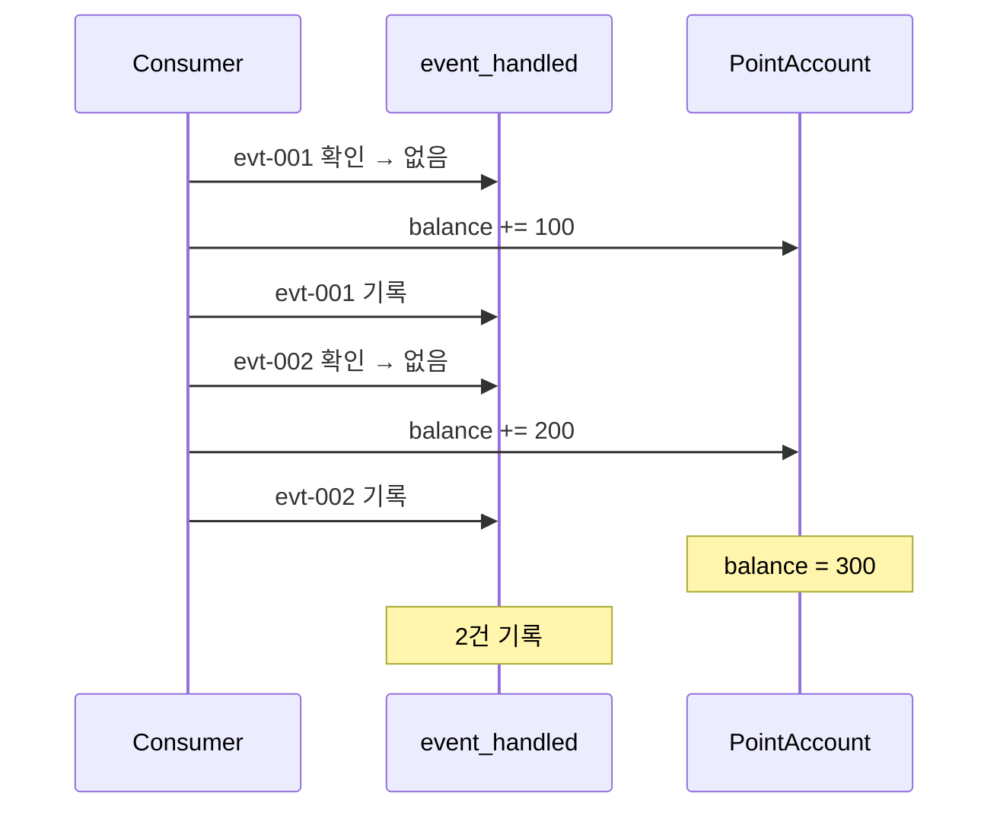

> **EventHandledIdempotencyTest** — `서로_다른_event_id의_메시지는_각각_정상_처리된다()`에서 확인.

여기서 중요한 점 두 가지.

첫째, **"처리 기록"과 "비즈니스 로직"이 같은 트랜잭션이어야 한다.** 포인트를 적립하고 event_handled에 기록하기 전에 죽으면, 재시작 시 또 적립한다. 둘을 같은 TX로 묶어야 "적립 + 기록"이 원자적으로 동작한다.

둘째, **event_id 컬럼에 UNIQUE 제약이 있어야 한다.** 같은 TX라고 해도 동시성 문제가 남아있다. 같은 eventId를 가진 메시지가 거의 동시에 2개의 Consumer에 도착하면, 둘 다 SELECT → "없음" → 처리 → INSERT를 시도할 수 있다. UNIQUE 제약이 있으면 두 번째 INSERT가 **제약 위반으로 실패 → TX 롤백 → 포인트 적립도 롤백**된다. 먼저 SELECT로 확인하는 건 **Early Check(불필요한 처리를 줄이는 최적화)**이고, UNIQUE 제약이 **최종 방어선**이다.

**장점:** 어떤 도메인이든 적용 가능. eventId만 있으면 된다.
**비용:** 별도 테이블 필요. 매 메시지마다 조회 1회 추가. 테이블이 커지면 관리 필요 (TTL, 파티셔닝).

---

## 패턴 2: Upsert — "있으면 덮어쓰고, 없으면 삽입한다"

집계성 데이터(조회수, 좋아요수, 판매량)에 적합한 방법.

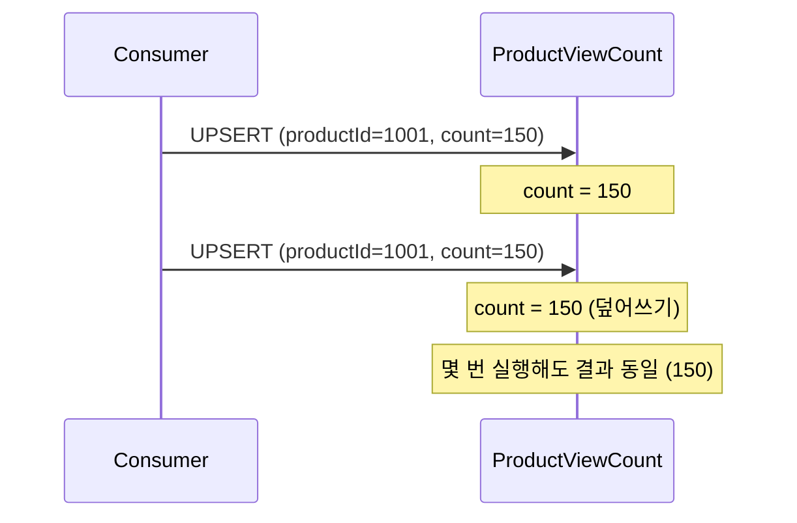

> **UpsertIdempotencyTest** — `같은_이벤트를_2번_처리해도_upsert로_올바른_결과가_유지된다()`에서 확인.

최신 값으로 덮어쓰니까 최종 상태가 항상 보장된다.

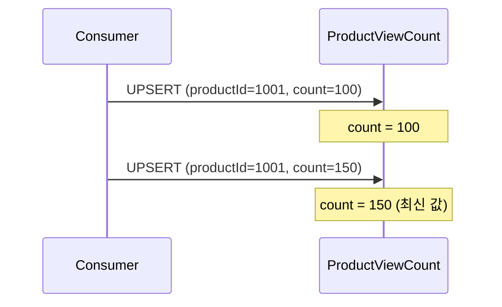

> **UpsertIdempotencyTest** — `upsert는_최신_값으로_덮어쓰므로_최종_상태가_보장된다()`에서 확인.

다른 상품의 이벤트는 각각 독립적으로 집계된다.

> **UpsertIdempotencyTest** — `다른_상품의_이벤트는_각각_독립적으로_upsert된다()`에서 확인.

여기서 한 가지 짚고 넘어가야 할 것이 있다. 조회수를 `+1`하는 upsert에서 같은 이벤트가 2번 오면 `+2`가 되지 않나? 맞다. **"최신 값으로 덮어쓰는" upsert는 멱등이지만, "+1 증분" upsert는 엄밀히 멱등이 아니다.** 조회수처럼 약간의 오차가 허용되는 집계에서 쓰는 패턴이다. 정확한 멱등이 필요하면 패턴 1(event_handled)이나 패턴 3(version)을 써야 한다.

**장점:** 별도 테이블 없음. 한 문장으로 끝남.
**비용:** 도메인 특성에 의존. "덮어쓰기"가 의미 있는 데이터에만 적합.

---

## 패턴 3: version 비교 — "현재보다 새로운 이벤트만 반영한다"

중복 방어를 넘어서 **순서 역전까지 방어**해야 할 때 쓰는 방법.

왜 순서 역전이 생기는가? 파티션이 다르거나, 재발행이 일어나면 발행 순서와 소비 순서가 달라질 수 있다.

```
발행 순서: v1(1000원) → v2(2000원) → v3(1500원)
소비 순서: v1(1000원) → v3(1500원) → v2(2000원)  ← 역전!

version 비교 없이: 최종 가격 = 2000원 (잘못됨, 1500원이어야 함)
version 비교 있음: v2는 v3보다 낮으므로 무시 → 최종 가격 = 1500원 (정확)
```

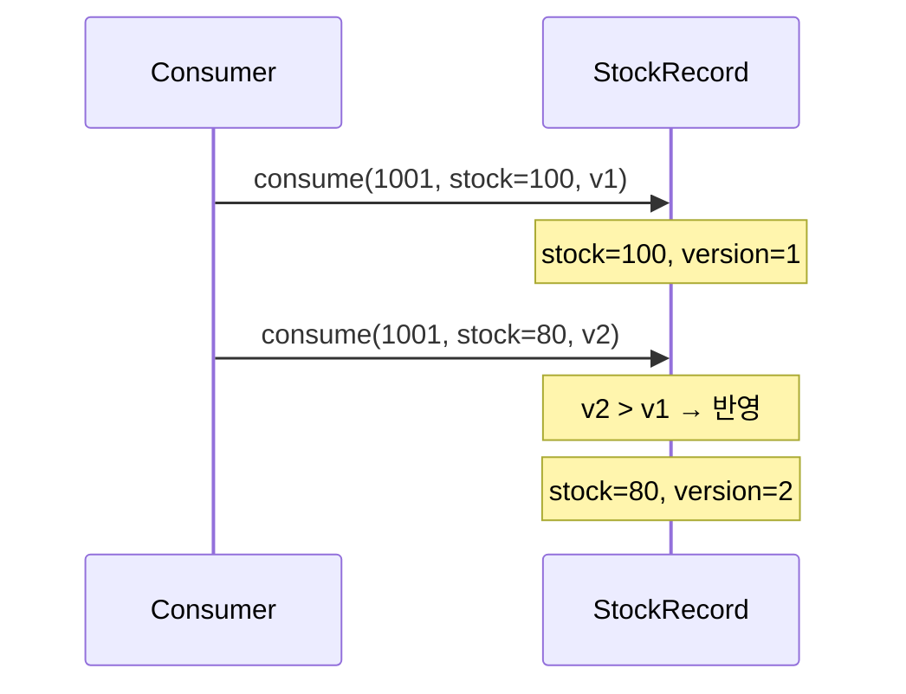

> **VersionComparisonIdempotencyTest** — `version이_현재보다_높은_이벤트만_반영된다()`에서 확인.

현재보다 낮거나 같은 version은 무시한다.

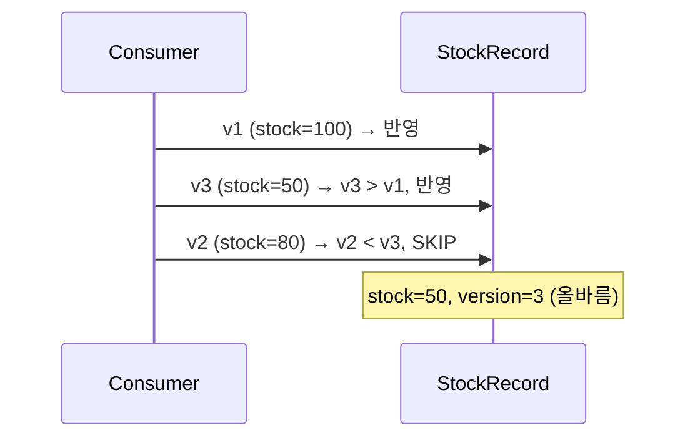

> **VersionComparisonIdempotencyTest** — `version이_현재보다_낮거나_같은_이벤트는_무시된다()`에서 확인.

순서가 뒤섞여서 v1 → v3 → v2 → v4로 도착해도, 최종 상태는 올바르다.

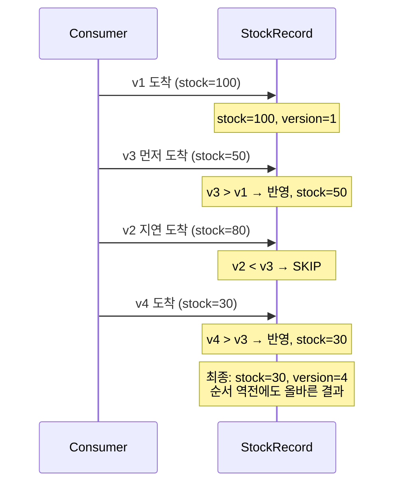

> **VersionComparisonIdempotencyTest** — `순서가_역전된_이벤트_시퀀스에서_최종_상태가_올바르다()`에서 확인.

**장점:** 중복 방어 + 순서 역전 방어를 동시에 해결.
**비용:** 이벤트에 version 필드가 필요. 구현 복잡도 높음.
**전제:** Producer가 단조 증가하는 version을 보장해야 한다. 보통 도메인 엔티티의 낙관적 락 버전(`@Version`, JPA가 자동 증가)이나, Producer가 명시적으로 부여한 시퀀스 번호를 쓴다. version이 단조 증가가 아니면 이 패턴은 깨진다.

---

## 어떤 패턴을 쓸 것인가

| 패턴 | 적합한 상황 | 핵심 메커니즘 | 비용 |
|------|-----------|------------|------|
| 상태 머신 | 단방향 상태 전이 도메인 | 현재 상태 확인 후 무시 | 없음 (도메인 로직 자체) |
| event_handled | 범용. 어떤 도메인이든 | eventId UNIQUE로 중복 차단 | 별도 테이블, 매번 조회 |
| Upsert | 집계성 데이터 (조회수, 좋아요수) | INSERT ON DUPLICATE KEY UPDATE | 도메인 의존적 |
| version 비교 | 순서 역전까지 방어 | UPDATE WHERE version < newVersion | 구현 복잡 |

## 컨슈머의 책임: 이벤트를 의심해야 한다

어떤 패턴을 쓸지 결정하기 전에, 한 가지 짚고 가자. **컨슈머는 프로듀서를 신뢰하면 안 된다.**

데이터 흐름으로 보면 프로듀서는 업스트림, 컨슈머는 다운스트림이다. 프로듀서는 리트라이 과정에서 같은 메시지를 2번 보낼 수 있고, 스키마가 바뀐 메시지를 보낼 수도 있다. **컨슈머는 "잘 들어왔겠지"가 아니라, 항상 "이 메시지가 정상인가?"를 검증해야 한다.** DLQ(아래에서 다룬다)가 필요한 이유도 여기서 출발한다.

이 원칙을 전제로, 이벤트는 멱등 처리 난이도에 따라 두 가지로 나뉜다.

```
1. 도메인 상태가 이미 멱등을 보장하는 이벤트
   - 위에서 다룬 상태 머신 패턴이 적용되는 경우
   - 추가 비용 없이 도메인 로직만으로 방어 가능
   - 비용이 낮다

2. 반드시 별도 장치로 멱등을 추가해야 하는 이벤트
   - 카운터 증가: 좋아요 +1이 2번 들어오면 랭킹이 조작됨
   - 포인트 적립: 100원이 2번 들어오면 200원
   - event_handled / upsert / version 비교가 필요
   - 비용이 높다 (수억 건의 처리 기록을 관리해야 할 수 있다)
```

이상적으로는 모든 이벤트가 "한 번만" 처리되는 게 좋다. 하지만 **"반드시 한 번"을 보장하려면 비용이 크기 때문에**, 비즈니스 임팩트에 따라 수준을 나누는 것이다.

---

## 멱등을 어디에 걸 것인가

"모든 Consumer에 멱등을 걸어야 하는가?"

**아니다.** Step 0에서 세운 판단 기준이 여기서도 쓰인다.

```
반드시 멱등이 필요한 곳:
  포인트 적립 — 중복되면 돈 문제
  결제 처리 — 이중 결제
  재고 차감 — 이중 차감
  → "중복되면 비즈니스에 영향이 있는가?" → Yes

멱등 없이도 괜찮을 수 있는 곳:
  알림 발송 — 같은 알림 2번. 불편하지만 치명적이지 않음
  로그 적재 — 로그가 2줄. 분석에 약간의 오차
  → "중복되면 비즈니스에 영향이 있는가?" → No
```

멱등 저장소로 DB와 Redis 중 어디를 쓸 것인가? **DB가 더 안전하다.** 이유는 두 가지다. 첫째, **원자성**: "event_handled INSERT + 포인트 적립"을 같은 TX로 묶어야 하는데, Redis와 MySQL은 서로 다른 시스템이라 하나의 TX로 못 묶는다. Step 6에서 다룬 "두 시스템 간 원자성은 불가능하다"와 같은 문제다. 둘째, **내구성**: Redis는 AOF persistence를 쓰더라도 재시작 시 마지막 fsync 이후 데이터가 유실될 수 있다. Redis는 앞단 트래픽 제어나 초고속 컷오프 용도에 더 가깝다.

---

## 처리 불가능한 메시지는 격리해야 한다

여기까지 "같은 메시지가 2번 오는" 중복 문제를 해결했다. 이제 다른 종류의 문제가 남아있다 — **"처리 자체가 불가능한 메시지"**다.

파싱이 안 되는 JSON, 스키마가 바뀐 이벤트, 필수 필드가 없는 메시지. 이런 **poison pill**은 몇 번을 재시도해도 실패한다. 그리고 이 메시지가 Consumer를 막으면 뒤에 있는 정상 메시지도 처리 못 한다.

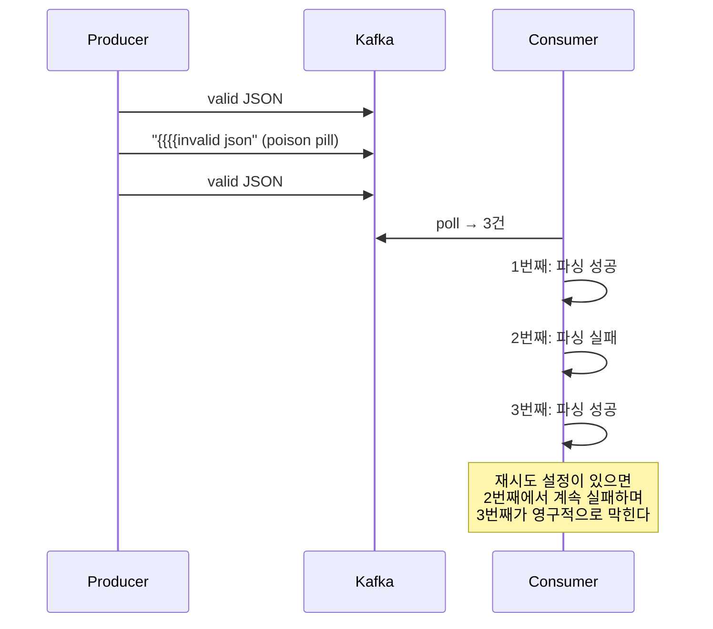

> **PoisonPillAndDlqTest** — `파싱_불가능한_메시지가_Consumer를_막는다()`에서 확인.

해결 방법이 **DLQ(Dead Letter Queue)**다. 처리 실패한 메시지를 별도 토픽으로 격리한다.

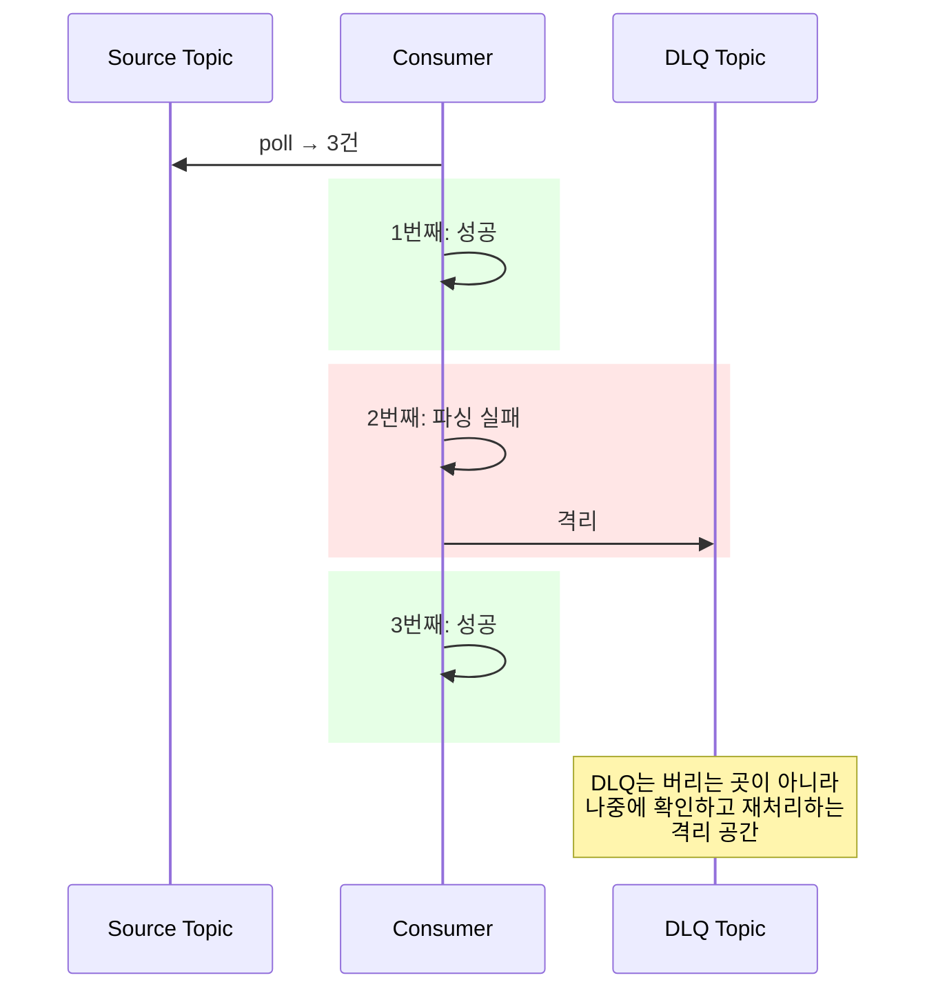

> **PoisonPillAndDlqTest** — `처리_실패한_메시지를_DLQ_토픽으로_격리할_수_있다()`에서 확인.

DLQ에 격리된 메시지는 나중에 운영자가 확인하고, 원인을 파악해서 수정하거나 재처리하거나 폐기한다. DLQ를 설정했다고 끝이 아니라, **"DLQ에 쌓인 걸 누가 보는가"**까지 운영 구조를 갖춰야 한다. 아무도 안 보면 유실이랑 다를 게 없다.

---

## 운영 관점에서 — Fail-Open vs Fail-Closed

멱등 처리와 DLQ는 "메시지 레벨"의 방어다. 하지만 인프라 자체가 죽으면? Redis가 내려가거나, Kafka 브로커가 응답 못 하거나, DB 커넥션이 부족하면?

이때 애플리케이션이 어떻게 반응할지는 **비즈니스 도메인에 따라 다르다.**

```
Fail-Open (공격적):
  장애가 나도 일단 처리를 진행한다.
  Redis 죽으면? DB fallback으로 처리한다.
  적합한 곳: 마케팅, 그로스, 알림 — "안 보내는 것보다 늦게라도 보내는 게 낫다"

Fail-Closed (보수적):
  장애가 나면 처리를 중단하고 에러를 반환한다.
  Redis 죽으면? "일시적 오류로 발급받을 수 없습니다."
  적합한 곳: 금전, 재고, 결제 — "잘못 처리하는 것보다 안 하는 게 낫다"

Graceful Degradation:
  Redis 죽었다 → DB Lock으로 버틴다
  DB도 위태하다 → 큐에 적재만 하고 비동기로 처리한다
  큐도 위태하다 → 요청을 거부하고 에러를 반환한다
```

중요한 건 "터지지 않게"가 아니라 **"터졌을 때 얼마나 빨리, 안전하게 회복할 수 있는가"**다.

---

## acks=all이어도 중복이 생기는 이유 — 전체 그림

Step 0~7을 순서대로 왔으면, 마지막으로 전체를 꿰는 질문이 남아있다.

> **"메시지가 Kafka 브로커에 진짜 적재됐다"는 걸 어떻게 보장하는가?**

답은 Kafka의 `acks` 설정이다.

```
acks=0:   Producer가 보내고 확인 안 기다림 (fire-and-forget)
          → 브로커가 받았는지 모름. 유실 가능.

acks=1:   Leader 브로커 1대만 디스크에 쓰면 ACK 반환
          → Leader가 ACK 보낸 직후 죽으면, 팔로워에 복제 안 된 메시지 유실.

acks=all: ISR(In-Sync Replicas) 전체가 복제 완료해야 ACK 반환
          → 가장 느리지만, 가장 안전.
```

`acks=all`이면 ISR 전체가 저장한 후에야 Producer에 ACK를 반환한다. **ACK를 받은 시점에 "브로커에 적재됐다"가 확정된다.**

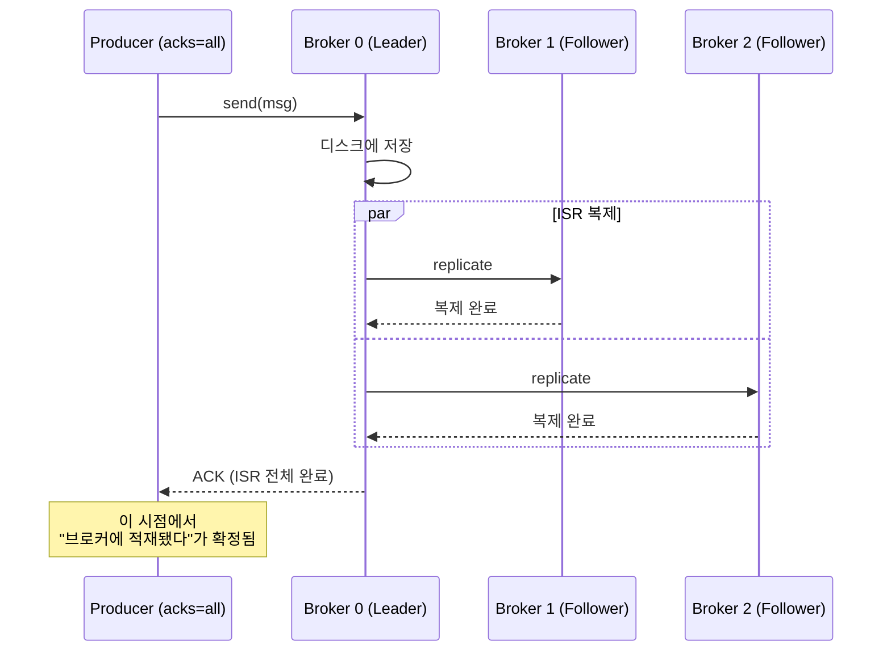

### 그러면 뭐가 문제인가? — ACK 후 SENT 전에 죽는 것

문제는 **"ACK를 받은 후, outbox status를 SENT로 바꾸기 전에 죽는 것"**이다.

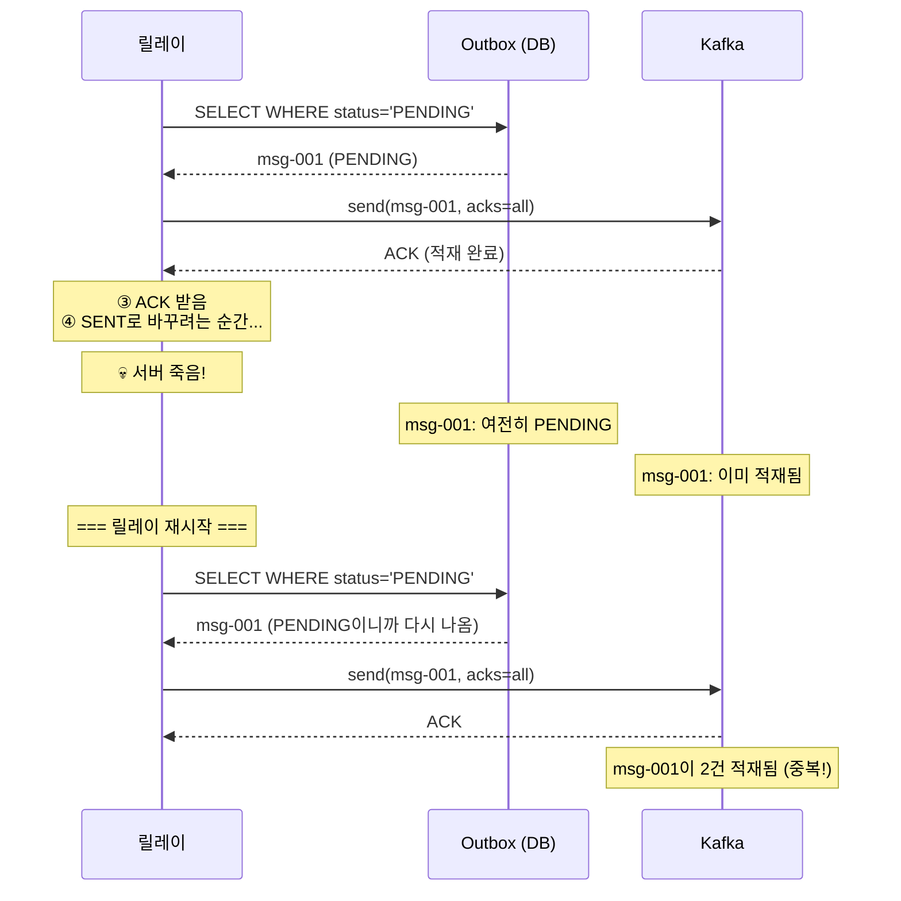

**발행이 안 된 게 아니다. 발행은 됐다.** "발행됐다는 사실을 기록 못 한 것"이 문제다. Kafka와 DB는 서로 다른 시스템이라 이 두 작업을 하나의 트랜잭션으로 묶을 수 없다.

서버가 죽는 것만이 아니다. **네트워크 타임아웃**으로도 같은 일이 벌어진다. Kafka가 ISR 전체에 저장까지 완료했는데 ACK 응답이 네트워크에서 유실되면, 릴레이는 "실패"로 판단하고 재시도한다. Kafka에는 이미 있는데 또 보내니까 2건이 된다.

Kafka에는 이걸 줄이기 위한 `enable.idempotence=true` 설정이 있다. Producer가 각 메시지에 시퀀스 번호를 붙이고, Broker가 중복 시퀀스를 거부하는 방식이다. 근데 이것도 **같은 Producer 세션(같은 PID) 내에서만 유효하다.** Producer가 재시작되면 새 PID가 할당되고 시퀀스가 리셋된다. 완벽하지 않다.

**이 틈은 어떤 방식을 써도 완전히 없앨 수 없다.** 그래서 Consumer 멱등이 필수다.

### 그래서 전부 합치면 이렇게 동작한다

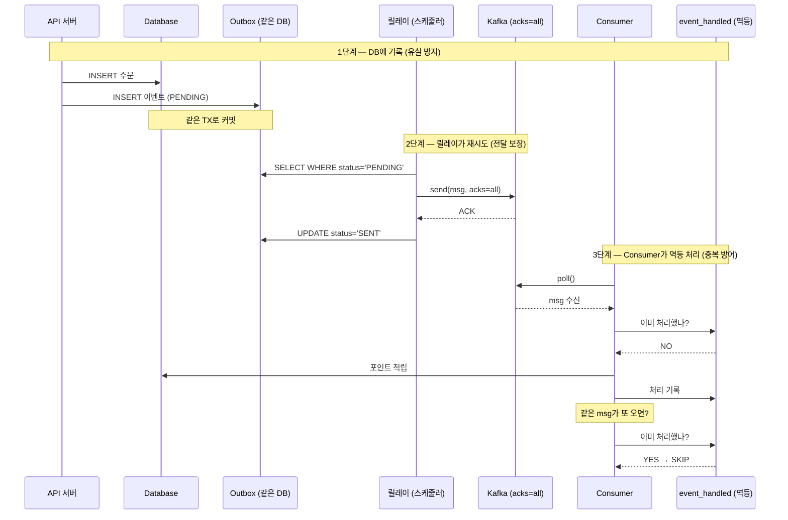

```
1단계는 유실을 막는다    — 서버가 죽어도 이벤트는 DB에 남아있다
2단계는 전달을 보장한다  — acks=all로 브로커 적재를 확정하고, 실패 시 재시도한다
3단계는 중복을 걸러낸다  — 2단계에서 재시도로 생긴 중복을 event_handled가 차단한다
```

**이 세 단계가 합쳐져서 "메시지가 정확히 한 번 처리된다"는 효과가 만들어진다.** Exactly-Once는 하나의 기술이 해주는 게 아니라, 여러 단계의 방어가 겹쳐서 달성되는 것이다.

### 설계 원칙 — Producer-Consumer 비대칭

> **Producer는 공격적으로 재시도한다. Consumer가 그것을 안전하게 만든다.**

Producer가 중복을 허용하더라도 보내는 것이 안 보내는 것보다 낫다. Consumer가 멱등 처리로 중복을 걸러내면 end-to-end로 exactly-once 효과를 얻는다. 이건 의도된 비대칭이다.

### 발행 실패는 유실이 아니다

Kafka 브로커가 장애 중이라 발행이 계속 실패하면? Outbox 테이블에 FAILED 상태로 남아있다. DB에 물리적으로 기록되어 있으니까 유실이 아니라 **미발행 상태**다. `@Async`나 `@TransactionalEventListener(AFTER_COMMIT)`이었으면 메모리에서 진짜 유실됐을 것이다(Step 2). Outbox는 **"발행 실패 = 나중에 다시 시도 가능"**이다. 진짜 유실은 DB 자체가 날아가는 경우이고, 그건 인프라 레벨에서 방어하는 영역이다.

### Exactly-Once Delivery는 불가능하다

이 전체 구조를 관통하는 원리가 있다. 분산 시스템의 **Two Generals Problem**과 유사한 구조다. 메시지가 도착했는지 확인하려면 확인 메시지를 보내야 하고, 그 확인이 도착했는지 확인하려면 또 메시지를 보내야 하고... 네트워크가 불완전하면 합의를 100% 보장할 수 없다.

분산 시스템에서 선택할 수 있는 건 딱 두 가지다.

```
At-most-once:  최대 1번 전달. 유실 가능, 중복 없음.
At-least-once: 최소 1번 전달. 유실 없음, 중복 가능.
```

Kafka가 "Exactly-once semantics"를 말하지만, 실제로는 **"at-least-once delivery + idempotent processing"의 조합**이다.

```
발행 측: At-least-once를 보장한다 (Outbox + 재시도 + acks=all)
수신 측: 멱등 처리를 보장한다 (event_handled + UNIQUE 제약)
합치면: effectively exactly-once
```

물리적으로 네트워크가 불완전하기 때문에, 한쪽에서 "정확히 1번"을 보장하는 건 불가능하다. **양쪽이 협력해야만 달성 가능하다.**

> **완벽한 자동화는 존재하지 않는다. 존재하는 건 "실패를 감지하고, 기록하고, 복구할 수 있는 구조"다.** Outbox 패턴이 그 구조를 제공하는 것이다.

---

## 여기까지 온 전체 여정

```
Step 0: Command vs Event — "뭘 분리할 수 있는가?"
Step 1: ApplicationEvent — "이벤트로 끊자" → 같은 TX라서 롤백 전파
Step 2: Transactional Event — "커밋 후에 실행" → 메모리 휘발 + 함정들
Step 3: Event Store — "DB에 기록" → 같은 프로세스 한계
Step 4: Redis Pub/Sub — "프로세스 밖으로" → 메시지 비보존
Step 5: RabbitMQ — "큐에 저장" → 소비하면 삭제
Step 6: Kafka — "소비해도 보존" + Outbox 완성 → 중복 소비
Step 7: Idempotent Consumer — "중복이 와도 한 번만 처리" + 실패 격리 + 전체 그림 완성
```

각 Step이 이전 Step의 한계를 해결했다. **메시징의 진화는 "갑자기 Kafka를 써야 해"가 아니라, 한계를 하나씩 넘은 결과다.**

그리고 이 전체를 관통하는 최종 공식은 이거다.

```
┌─────────────────────────────────────────────────────────────┐
│                                                             │
│  발행 보장:  Outbox + 릴레이 + acks=all                      │
│            → "한 번은 반드시 브로커에 적재된다"               │
│                                                             │
│  중복 방어:  event_handled + UNIQUE 제약                     │
│            → "2번 와도 1번만 처리한다"                       │
│                                                             │
│  실패 격리:  DLQ (Dead Letter Queue)                        │
│            → "처리 못 하는 메시지가 정상 흐름을 막지 않는다"  │
│                                                             │
└─────────────────────────────────────────────────────────────┘
```

이 공식은 Kafka든 RabbitMQ든 SQS든, 메시지 기반 시스템이면 동일하게 적용된다.

이 전체 여정을 관통하는 설계 원칙을 6개 레이어로 정리한 문서가 있다.
내구성 → 원자성 → 전달 보장 → 확인 → 멱등성 → 관측.
아래 레이어가 무너지면 위 레이어는 의미가 없다.
어떤 설계든 "Layer 몇에서 탈락하는가?"로 검증할 수 있다.
→ [PRINCIPLES.md](PRINCIPLES.md)

---

## 스스로 답해보자

- At Least Once에서 왜 중복이 생기는가? 구체적인 시나리오 2개를 말할 수 있는가?
- event_handled 패턴에서 "처리 기록"과 "비즈니스 로직"이 같은 트랜잭션이어야 하는 이유는?
- event_handled에서 UNIQUE 제약이 왜 최종 방어선인가? SELECT 확인만으로 왜 부족한가?
- Upsert에서 "덮어쓰기"와 "+1 증분"의 멱등성 차이는?
- version 비교가 순서 역전을 방어하는 원리는? version은 누가 보장하는가?
- "모든 Consumer에 멱등을 걸어야 하는가?"에 대한 판단 기준은?
- 멱등성 저장소로 Redis보다 DB가 안전한 이유는? (원자성과 내구성 관점에서)
- Poison pill이 왜 위험하고, DLQ를 설정했다고 끝이 아닌 이유는?
- `acks=all`이 보장하는 것은 무엇이고, 보장하지 못하는 것은 무엇인가?
- 릴레이가 ACK를 받고 SENT로 바꾸기 전에 죽으면 어떤 일이 생기는가?
- "발행 보장 + 중복 방어 + 실패 격리" 3단계가 각각 어떤 문제를 해결하는가?
- "Producer는 공격적으로 재시도하고, Consumer가 안전하게 만든다" — 이 비대칭이 왜 의도된 것인가?
- Kafka 발행이 N회 전부 실패해서 FAILED가 됐다. 이 이벤트는 "유실"인가?
- `enable.idempotence=true`가 중복을 방지하는 범위는? Producer가 재시작되면?

> 전부 답이 나오면 messaging-lab을 완주한 것이다.

---

## 참고

| 주제 | 링크 |
|------|------|
| 배민 포인트 시스템 (SQS 순서 역전 + DLQ) | [신규 포인트 시스템 전환기 #1 — 우아한형제들 기술블로그](https://woowabros.github.io/experience/2018/10/12/new_point_story_1.html) |
| Transactional Outbox + Idempotent Consumer | [Microservices.io — Transactional Outbox](https://microservices.io/patterns/data/transactional-outbox.html) |
| Kafka Consumer Semantics | [Apache Kafka Documentation — Consumer](https://kafka.apache.org/documentation/#consumerconfigs) |